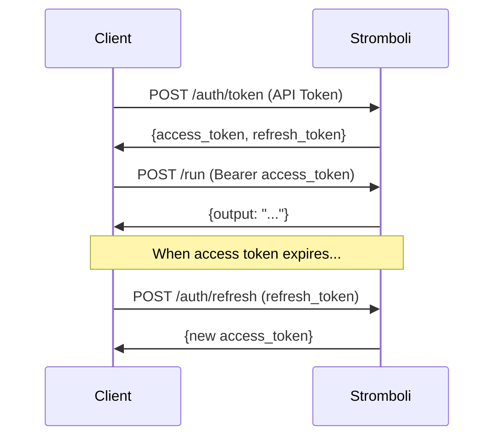

# Authentication

Stromboli supports JWT-based authentication for securing the API.

## Setup

```bash
export STROMBOLI_AUTH_ENABLED=true
export STROMBOLI_JWT_SECRET="$(openssl rand -base64 32)"
export STROMBOLI_API_TOKENS="your-api-token"
```

## Flow



## Get tokens

### POST /auth/token

Exchange an API token for JWT tokens:

```bash
curl -X POST localhost:8080/auth/token \
  -H "Authorization: Bearer your-api-token" \
  -d '{"client_id": "my-app"}'
```

```json
{
  "access_token": "eyJhbGciOi...",
  "refresh_token": "eyJhbGciOi...",
  "token_type": "Bearer",
  "expires_in": 3600
}
```

## Use tokens

```bash
curl -X POST localhost:8080/run \
  -H "Authorization: Bearer eyJhbGciOi..." \
  -d '{"prompt": "Hello"}'
```

## Refresh tokens

### POST /auth/refresh

```bash
curl -X POST localhost:8080/auth/refresh \
  -d '{"refresh_token": "eyJhbGciOi..."}'
```

## Validate tokens

### POST /auth/validate

```bash
curl -X POST localhost:8080/auth/validate \
  -H "Authorization: Bearer eyJhbGciOi..."
```

```json
{"valid": true, "claims": {"sub": "my-app", "exp": 1640000000}}
```

## Logout

### POST /auth/logout

Adds the token to a blacklist:

```bash
curl -X POST localhost:8080/auth/logout \
  -H "Authorization: Bearer eyJhbGciOi..."
```

## Token lifetimes

| Token | Default lifetime | Configurable |
|---|---|---|
| Access | 24 hours | `STROMBOLI_JWT_EXPIRY` |
| Refresh | 7 days | `STROMBOLI_JWT_REFRESH_EXPIRY` |

## Public endpoints

These don't require authentication:

- `GET /health`
- `GET /metrics`
- `POST /auth/token` (requires API token in header)
- `POST /auth/refresh`

## Error responses

| Status | Error |
|---|---|
| 401 | `token required` — no token provided |
| 401 | `invalid token` — malformed or invalid |
| 401 | `token expired` — expired token |
| 401 | `token blacklisted` — logged out token |

## Security tips

- Generate strong secrets: `openssl rand -base64 32`
- Don't store tokens in localStorage — use httpOnly cookies
- Rotate JWT secrets periodically
- Always use HTTPS in production
