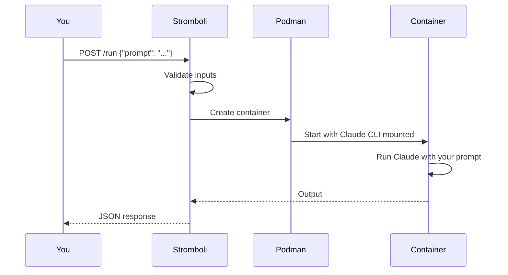

# How It Works

Stromboli sits between your code and Claude Code, wrapping each agent run in an isolated Podman container.

## The basics

When you send a request to Stromboli's API, here's what happens:



1. **You send a prompt** via HTTP — curl, Python, JavaScript, whatever speaks REST.
2. **Stromboli validates** the request — checks volumes against the allowlist, validates the image, enforces resource limits.
3. **Podman creates a container** from your chosen base image (or the default agent image).
4. **Claude CLI gets mounted** into the container from a separate CLI image. This means any glibc-based image works as a base.
5. **Claude runs your prompt** inside the container, with access to whatever volumes you mounted.
6. **Output comes back** as JSON, including a `session_id` you can use to continue the conversation later.
7. **Container is cleaned up** — force-removed after execution even if `--rm` fails (e.g. after OOM kill or timeout).

## The two-image architecture

Stromboli uses two images for every agent run:

```
┌─────────────────────────────────────────┐
│  Agent Container                        │
│                                         │
│  Base Image (python, node, go, etc.)    │
│       +                                 │
│  Claude CLI (mounted from CLI image)    │
│       +                                 │
│  Your workspace (volume mount)          │
│       +                                 │
│  Credentials (Podman secret)            │
└─────────────────────────────────────────┘
```

**CLI image** — Contains the Claude Code binary. Stromboli mounts it into agent containers at `/opt/claude`. This image is pulled once and reused.

**Base image** — The environment where Claude actually runs. Defaults to the official Stromboli agent image, but you can use any glibc-based Docker image (`python:3.12`, `node:20`, `golang:1.22`, etc.).

This split means you can use any language runtime without rebuilding Claude into every image.

!!! warning "Alpine images don't work"
    Claude CLI requires glibc. Alpine uses musl, so `python:3.12-alpine` and similar images are incompatible. Use the standard (Debian-based) variants instead.

## Execution modes

Stromboli supports three ways to run agents:

| Mode | Endpoint | Use case |
|------|----------|----------|
| **Sync** | `POST /run` | Short tasks — get the result in the response |
| **Async** | `POST /run/async` | Long tasks — get a `job_id`, poll for results |
| **Streaming** | `GET /run/stream` | Real-time output via Server-Sent Events |

All three modes create the same container behind the scenes. The difference is how you receive the output.

## Sessions

Every agent run creates a session. Sessions store Claude's conversation history so you can resume later:

```bash
# First request — creates a session
curl -X POST localhost:8080/run -d '{"prompt": "Analyze this code"}'
# Response includes session_id: "abc-123"

# Resume the same conversation
curl -X POST localhost:8080/run -d '{
  "prompt": "Now fix the bug you found",
  "claude": {"session_id": "abc-123", "resume": true}
}'
```

Session data lives on disk (configurable path). When you resume, Stromboli mounts the session directory into a fresh container — Claude picks up right where it left off. See [sessions](../guides/sessions.md) for details.

## Security layers

Every request passes through multiple validation layers before a container is created:

| Layer | What it checks |
|-------|----------------|
| **Authentication** | JWT or API token (when enabled) |
| **Rate limiting** | Per-IP request throttling |
| **Input validation** | Prompt size, path traversal, character encoding |
| **Volume allowlist** | Host paths must be explicitly allowed |
| **Image allowlist** | Only approved images can be used |
| **Container path blocklist** | Prevents mounting over `/etc`, `~/.ssh`, etc. |
| **Resource limits** | Memory, CPU, and timeout caps |

Containers run rootless via Podman — even a container escape gives the attacker unprivileged access. See [security overview](../security/overview.md) for the full picture.

## What's next

- [Quick start](../getting-started/quickstart.md) — Get Stromboli running in 5 minutes
- [Running agents](../guides/running-agents.md) — All the options for spawning agents
- [Custom images](../guides/custom-images.md) — Use Python, Node, Go, or any glibc image
