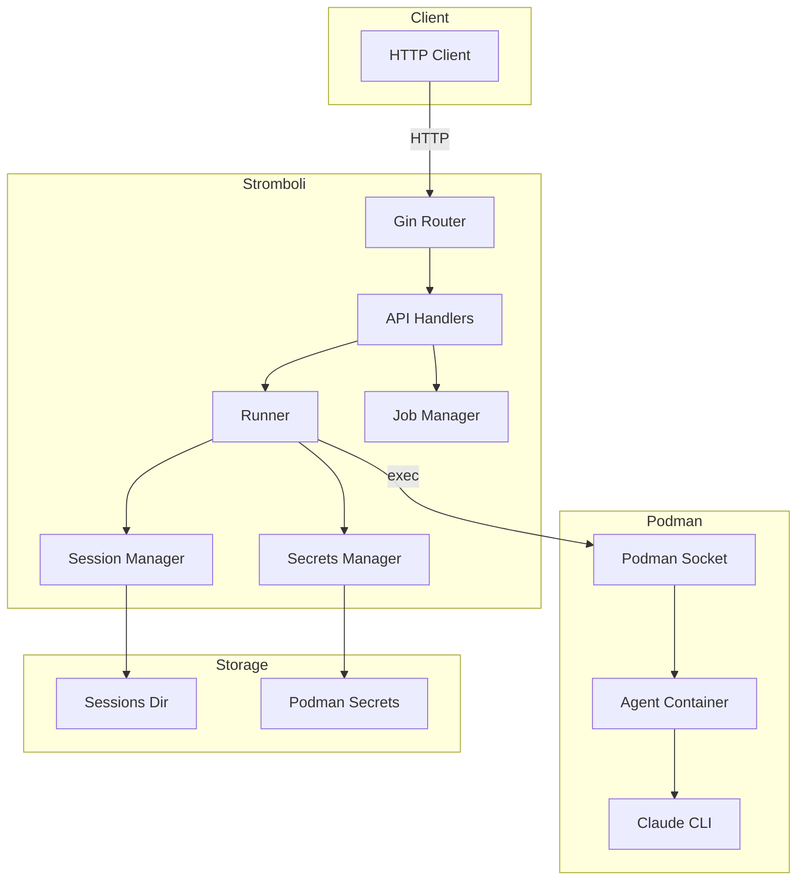
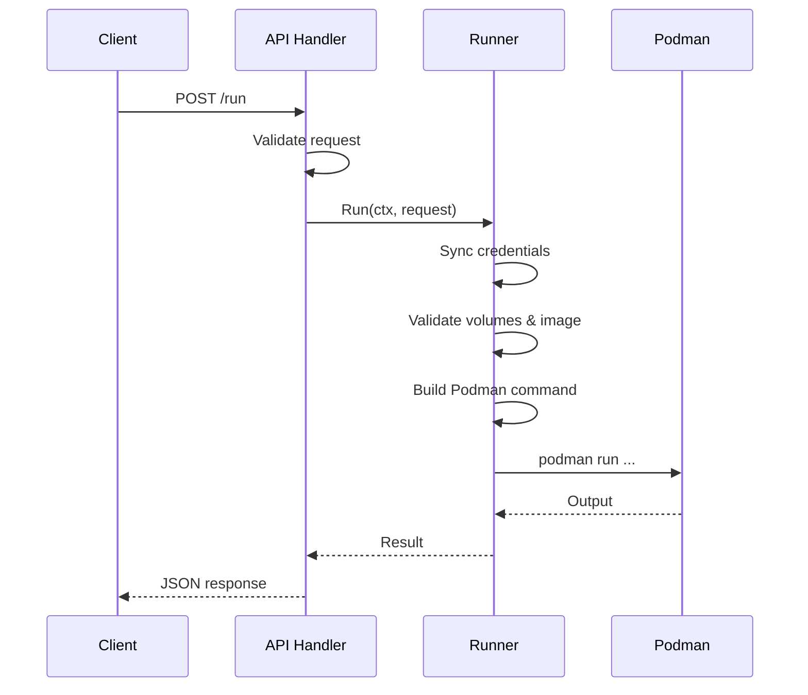
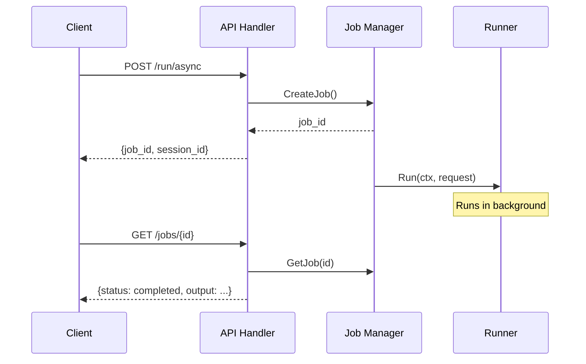
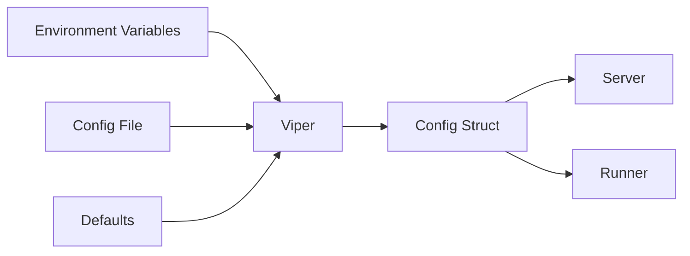

# Architecture

How Stromboli is organized internally.

## High-level overview



## Package structure

```
stromboli/
├── cmd/stromboli/        # Entry point (main.go — just wiring)
├── internal/
│   ├── api/              # HTTP handlers, middleware, routes
│   ├── runner/           # Container execution, validation
│   ├── podman/           # Podman command builder
│   ├── claude/           # Claude CLI argument builder
│   ├── secrets/          # Podman secrets sync
│   ├── session/          # Session storage management
│   ├── job/              # Async job lifecycle
│   ├── workspace/        # Path allowlist validation
│   ├── auth/             # JWT tokens, auth middleware
│   ├── config/           # Viper config loading
│   ├── types/            # Shared types (ClaudeOptions, PodmanOptions)
│   ├── tracing/          # OpenTelemetry
│   └── version/          # Version info
├── docs/                 # MkDocs documentation
├── deployments/          # Docker/Compose files
└── api/                  # OpenAPI specs
```

## Request flow

### Synchronous



### Async



## Key interfaces

```go
// Runner — executes Claude in containers
type Runner interface {
    Run(ctx context.Context, req Request) (*Result, error)
    RunStream(ctx context.Context, req Request, output chan<- string) (*Result, error)
    RunAsync(ctx context.Context, req Request, jobID string, onComplete func(*Result, error))
    DestroySession(sessionID string) error
    ListSessions() ([]string, error)
}

// Executor — runs shell commands (mockable for tests)
type Executor interface {
    Run(ctx context.Context, args []string) ([]byte, error)
    RunStream(ctx context.Context, args []string) (stdout, stderr io.ReadCloser, start func() error, wait func() error, err error)
}
```

## Security model

Credentials flow through Podman secrets, never through the API:

```
Host: ~/.claude/.credentials.json → Podman Secret → Container: /home/user/.claude/.credentials.json
```

Volumes go through allowlist validation before any mount happens:

```
API Request: volumes=["/home/user/code:/workspace"] → Allowlist check → Mount
```

## Configuration flow



## Error handling

Errors wrap with context at each layer:

```go
// runner layer
return nil, fmt.Errorf("failed to create container: %w", err)

// api layer
return nil, fmt.Errorf("execution failed: %w", err)
```

API returns structured JSON errors:

```json
{"error": "execution failed: image not found", "status": "error"}
```
