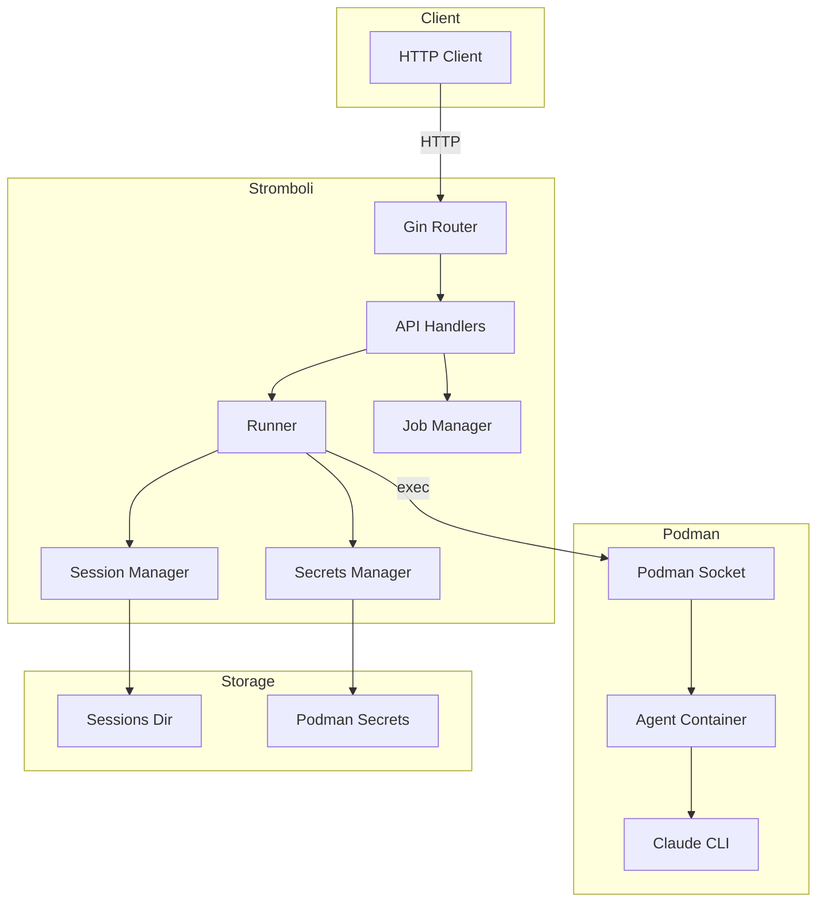
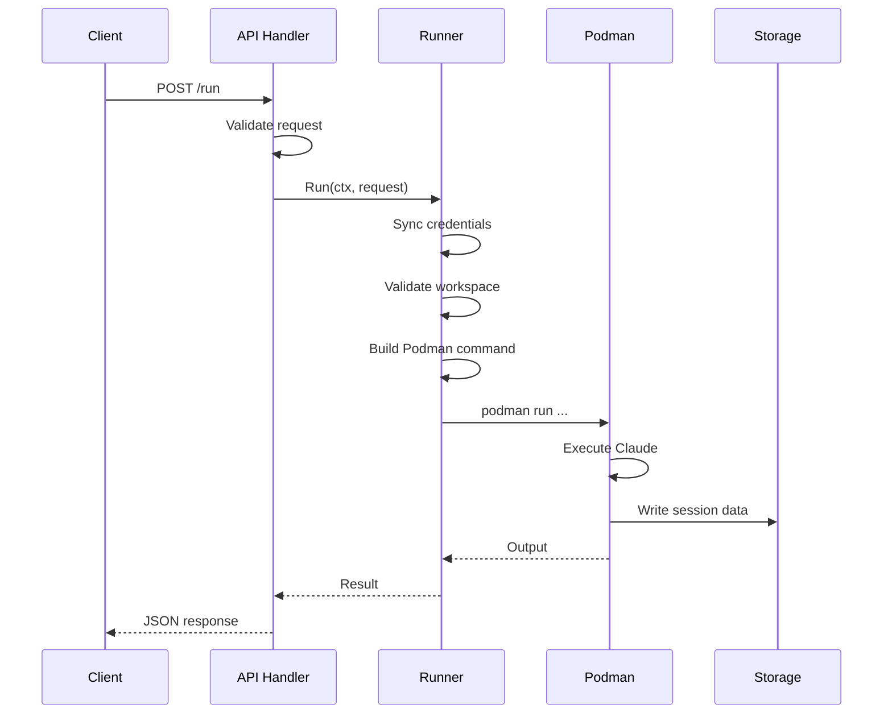
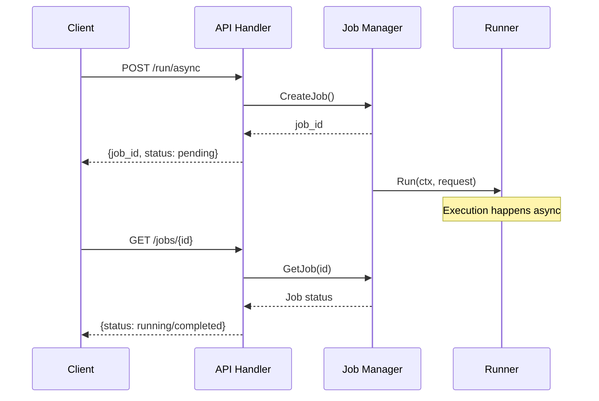
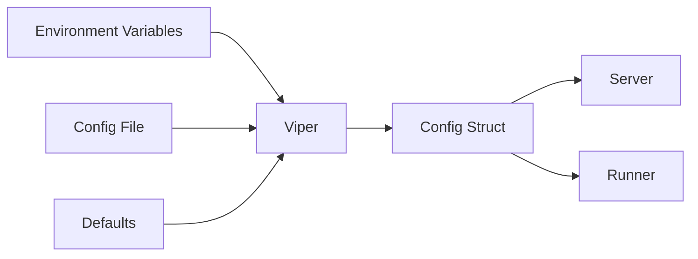

# Architecture

Overview of Stromboli's internal architecture.

## High-Level Architecture



## Package Structure

```
stromboli/
├── cmd/stromboli/           # Entry point
│   └── main.go              # Minimal - just wiring
│
├── internal/                # Private packages
│   ├── api/                 # HTTP layer
│   │   ├── server.go        # Router setup
│   │   ├── run.go           # Request/response types
│   │   ├── async.go         # Async job handlers
│   │   ├── health.go        # Health checks
│   │   ├── auth.go          # JWT authentication
│   │   └── middleware.go    # Rate limiting, logging
│   │
│   ├── runner/              # Container execution
│   │   ├── runner.go        # PodmanRunner
│   │   ├── executor.go      # Command execution interface
│   │   ├── image.go         # Image validation
│   │   └── validation.go    # Input validation
│   │
│   ├── podman/              # Podman command building
│   │   └── builder.go       # Fluent command builder
│   │
│   ├── claude/              # Claude CLI integration
│   │   └── builder.go       # CLI argument builder
│   │
│   ├── secrets/             # Credentials management
│   │   └── secrets.go       # Podman secrets sync
│   │
│   ├── session/             # Session storage
│   │   └── manager.go       # Create/destroy sessions
│   │
│   ├── job/                 # Async job management
│   │   └── manager.go       # Job lifecycle
│   │
│   ├── workspace/           # Workspace validation
│   │   └── validator.go     # Path allowlist
│   │
│   ├── auth/                # Authentication
│   │   ├── jwt.go           # Token generation
│   │   └── middleware.go    # Auth middleware
│   │
│   ├── config/              # Configuration
│   │   └── config.go        # Viper config loading
│   │
│   └── types/               # Shared types
│       └── options.go       # ClaudeOptions, PodmanOptions
│
├── docs/                    # Documentation (MkDocs)
├── deployments/             # Docker/Compose files
└── api/                     # OpenAPI specs
```

## Request Flow

### Synchronous Execution



### Async Execution



## Key Interfaces

### Runner

```go
type Runner interface {
    Run(ctx context.Context, req Request) (*Result, error)
    RunStream(ctx context.Context, req Request, output chan<- string) (*Result, error)
    RunAsync(ctx context.Context, req Request, jobID string, onComplete func(*Result, error))
    DestroySession(sessionID string) error
    ListSessions() ([]string, error)
}
```

### Executor

```go
type Executor interface {
    Run(ctx context.Context, args []string) ([]byte, error)
    RunStream(ctx context.Context, args []string) (stdout, stderr io.ReadCloser, start func() error, wait func() error, err error)
}
```

## Security Model

### Container Isolation

Each agent runs in an isolated Podman container with:
- Separate network namespace
- Resource limits (CPU, memory)
- Read-only root filesystem
- Non-root user
- No privileged capabilities

### Credentials

```
Host                          Container
~/.claude/.credentials.json → Podman Secret → /home/user/.claude/.credentials.json
```

Credentials never pass through the API - they're injected via Podman secrets.

### Workspace Security

```
API Request          Validation           Container
workspace=/foo → Allowlist check → Mount at /workspace
```

Only directories in the allowlist can be mounted.

## Configuration Flow



## Error Handling

Errors are wrapped with context at each layer:

```go
// runner/runner.go
return nil, fmt.Errorf("failed to create container: %w", err)

// api/server.go
return nil, fmt.Errorf("execution failed: %w", err)
```

API returns structured errors:
```json
{
  "error": "execution failed: failed to create container: image not found",
  "status": "error"
}
```
