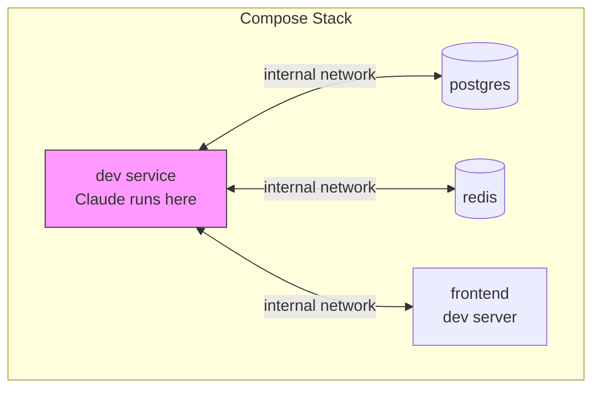

# Compose Environments

Compose environments allow Claude agents to run in multi-service environments defined by Docker/Podman Compose files. This enables agents to work alongside databases, caches, frontends, and other services.

## Overview

Instead of running Claude in a standalone container, you can run it inside a compose stack with multiple services:



## When to Use Compose Environments

| Use Case | Single Container | Compose Environment |
|----------|-----------------|---------------------|
| Code review/analysis | Preferred | Overkill |
| Simple scripts | Preferred | Overkill |
| Full-stack development | Limited | **Recommended** |
| Integration testing | Limited | **Recommended** |
| Database operations | Not possible | **Required** |
| Multi-service debugging | Not possible | **Required** |

## Basic Usage

### 1. Create a Compose File

Create a `docker-compose.yml` in your project:

```yaml
# /home/user/myproject/docker-compose.yml
services:
  dev:
    image: python:3.12
    working_dir: /workspace
    volumes:
      - .:/workspace
    depends_on:
      - db
      - redis

  db:
    image: postgres:16
    environment:
      POSTGRES_PASSWORD: devpass
      POSTGRES_DB: myapp

  redis:
    image: redis:7
```

### 2. Run Claude in the Compose Environment

```bash
curl -X POST http://localhost:8080/run \
  -H "Content-Type: application/json" \
  -d '{
    "prompt": "Set up the database schema and add some test data",
    "workdir": "/workspace",
    "podman": {
      "environment": {
        "type": "compose",
        "path": "/home/user/myproject/docker-compose.yml",
        "service": "dev"
      }
    }
  }'
```

## Configuration

### Environment Options

| Field | Type | Required | Description |
|-------|------|----------|-------------|
| `type` | string | Yes | Must be `"compose"` |
| `path` | string | Yes | Absolute path to compose file |
| `service` | string | Yes | Service where Claude runs |
| `build_timeout` | string | No | Override build timeout (default: 10m) |

### Server Configuration

Configure compose behavior in `stromboli.yaml`:

```yaml
compose:
  # Security settings (all false by default)
  allow_privileged: false
  allow_host_network: false
  allow_host_volumes: false

  # Timeouts
  build_timeout: "10m"     # Max time for compose build/up
  health_timeout: "2m"     # Max time to wait for healthy services

  # Cleanup
  stack_ttl: "1h"          # Max age for orphaned stacks
```

Or via environment variables:

```bash
export STROMBOLI_COMPOSE_ALLOW_PRIVILEGED=false
export STROMBOLI_COMPOSE_ALLOW_HOST_NETWORK=false
export STROMBOLI_COMPOSE_ALLOW_HOST_VOLUMES=false
export STROMBOLI_COMPOSE_BUILD_TIMEOUT=10m
export STROMBOLI_COMPOSE_HEALTH_TIMEOUT=2m
export STROMBOLI_COMPOSE_STACK_TTL=1h
```

## Compose File Requirements

### Required Structure

Your compose file must:

1. Define the service specified in `service` field
2. Use only allowed configurations (see Security below)
3. Be at an absolute path ending in `.yml` or `.yaml`

### Health Checks

Services should define health checks for reliable startup:

```yaml
services:
  db:
    image: postgres:16
    environment:
      POSTGRES_PASSWORD: devpass
    healthcheck:
      test: ["CMD-SHELL", "pg_isready -U postgres"]
      interval: 5s
      timeout: 5s
      retries: 5
```

Stromboli waits for all services to become healthy before running Claude.

## Examples

### Full-Stack Web Application

```yaml
# docker-compose.yml
services:
  dev:
    image: node:20
    working_dir: /app
    volumes:
      - .:/app
    environment:
      DATABASE_URL: postgres://postgres:devpass@db:5432/myapp
      REDIS_URL: redis://redis:6379
    depends_on:
      db:
        condition: service_healthy
      redis:
        condition: service_started

  db:
    image: postgres:16
    environment:
      POSTGRES_PASSWORD: devpass
      POSTGRES_DB: myapp
    healthcheck:
      test: ["CMD-SHELL", "pg_isready -U postgres"]
      interval: 5s
      timeout: 5s
      retries: 5

  redis:
    image: redis:7
```

```bash
curl -X POST http://localhost:8080/run \
  -d '{
    "prompt": "Add a caching layer to the user authentication service",
    "workdir": "/app",
    "podman": {
      "environment": {
        "type": "compose",
        "path": "/home/user/webapp/docker-compose.yml",
        "service": "dev"
      }
    }
  }'
```

### Python with PostgreSQL and Celery

```yaml
# docker-compose.yml
services:
  dev:
    image: python:3.12
    working_dir: /workspace
    volumes:
      - .:/workspace
    environment:
      DATABASE_URL: postgres://postgres:devpass@db:5432/myapp
      CELERY_BROKER_URL: redis://redis:6379/0
    depends_on:
      - db
      - redis

  db:
    image: postgres:16
    environment:
      POSTGRES_PASSWORD: devpass
      POSTGRES_DB: myapp
    healthcheck:
      test: ["CMD-SHELL", "pg_isready"]
      interval: 5s
      timeout: 5s
      retries: 5

  redis:
    image: redis:7

  worker:
    image: python:3.12
    working_dir: /workspace
    volumes:
      - .:/workspace
    command: celery -A tasks worker --loglevel=info
    depends_on:
      - redis
```

### Go Microservices

```yaml
# docker-compose.yml
services:
  dev:
    image: golang:1.22
    working_dir: /workspace
    volumes:
      - .:/workspace
      - gomodcache:/go/pkg/mod
    environment:
      USER_SERVICE_URL: http://user-svc:8081
      ORDER_SERVICE_URL: http://order-svc:8082

  user-svc:
    build:
      context: ./services/user
    ports:
      - "8081:8081"

  order-svc:
    build:
      context: ./services/order
    ports:
      - "8082:8082"

  db:
    image: postgres:16
    environment:
      POSTGRES_PASSWORD: devpass

volumes:
  gomodcache:
```

## Stack Lifecycle

### Starting a Stack

When you make a request with a compose environment:

1. **Validation** - Compose file is validated for security
2. **Build** - Services are built if needed
3. **Start** - All services are started
4. **Health Check** - Wait for services to become healthy
5. **Execute** - Claude runs in the specified service

### Session Persistence

Compose stacks persist with sessions:

```bash
# First request - stack starts
curl -X POST http://localhost:8080/run \
  -d '{
    "prompt": "Initialize the database",
    "podman": {
      "environment": {
        "type": "compose",
        "path": "/home/user/project/docker-compose.yml",
        "service": "dev"
      }
    }
  }'
# Response: {"session_id": "abc123", ...}

# Resume - same stack, data persists
curl -X POST http://localhost:8080/run \
  -d '{
    "prompt": "Add more test data to the database",
    "claude": {
      "session_id": "abc123",
      "resume": true
    },
    "podman": {
      "environment": {
        "type": "compose",
        "path": "/home/user/project/docker-compose.yml",
        "service": "dev"
      }
    }
  }'
```

### Cleanup

Stacks are cleaned up when:

- Session is destroyed (`DELETE /sessions/{id}`)
- Stack exceeds TTL (`stack_ttl` config)
- Stromboli shuts down gracefully

## Security

### Blocked Configurations

By default, these compose configurations are **blocked**:

| Configuration | Risk | To Allow |
|---------------|------|----------|
| `privileged: true` | Container escape | `allow_privileged: true` |
| `cap_add: ALL` | Full capabilities | Not allowed |
| `cap_add: SYS_ADMIN` | Near-root access | Not allowed |
| `network_mode: host` | Network namespace escape | `allow_host_network: true` |
| `ipc: host` | IPC namespace sharing | Not allowed |
| `pid: host` | PID namespace sharing | Not allowed |
| `userns_mode: host` | User namespace escape | Not allowed |
| `devices: [...]` | Device access | Not allowed |
| `security_opt: seccomp:unconfined` | Disabled seccomp | Not allowed |
| `security_opt: apparmor:unconfined` | Disabled AppArmor | Not allowed |
| Host volume mounts | Filesystem access | `allow_host_volumes: true` |
| Dangerous sysctls | Kernel tampering | Not allowed |

### Safe Compose Example

```yaml
# This compose file passes all security checks
services:
  dev:
    image: python:3.12
    working_dir: /workspace
    # No privileged, no host network, no host volumes

  db:
    image: postgres:16
    environment:
      POSTGRES_PASSWORD: devpass
    # Named volumes are allowed
    volumes:
      - pgdata:/var/lib/postgresql/data

volumes:
  pgdata:
```

### Blocked Compose Example

```yaml
# This compose file will be REJECTED
services:
  dev:
    image: python:3.12
    privileged: true              # BLOCKED: privileged
    network_mode: host            # BLOCKED: host network
    volumes:
      - /etc/passwd:/etc/passwd   # BLOCKED: host volume
    cap_add:
      - SYS_ADMIN                 # BLOCKED: dangerous capability
```

## Combining with Lifecycle Hooks

You can use lifecycle hooks with compose environments:

```bash
curl -X POST http://localhost:8080/run \
  -d '{
    "prompt": "Run the integration tests",
    "workdir": "/workspace",
    "podman": {
      "environment": {
        "type": "compose",
        "path": "/home/user/project/docker-compose.yml",
        "service": "dev"
      },
      "lifecycle": {
        "on_create_command": ["pip install -r requirements.txt"],
        "post_start": ["./wait-for-db.sh"]
      }
    }
  }'
```

Hooks run inside the specified service container after the stack is healthy.

## Troubleshooting

### Stack Failed to Start

**Symptom:** Error "failed to start compose stack"

**Causes:**
1. Invalid compose file syntax
2. Build failure
3. Image pull failure

**Solution:**
```bash
# Test locally
podman compose -f /path/to/docker-compose.yml up
```

### Health Check Timeout

**Symptom:** Error "health check failed"

**Causes:**
1. Services don't have health checks
2. Services are slow to start
3. Misconfigured dependencies

**Solutions:**

Add health checks to services:
```yaml
healthcheck:
  test: ["CMD-SHELL", "curl -f http://localhost:8080/health"]
  interval: 5s
  timeout: 5s
  retries: 10
```

Increase health timeout:
```bash
export STROMBOLI_COMPOSE_HEALTH_TIMEOUT=5m
```

### Service Not Found

**Symptom:** Error "service 'dev' not found in compose file"

**Solution:** Ensure the `service` field matches a service defined in your compose file.

### Security Validation Failed

**Symptom:** Error "compose file validation failed: privileged services not allowed"

**Solution:** Remove the blocked configuration or enable the corresponding allow flag (not recommended for production).

## Best Practices

### 1. Use Named Volumes for Data

```yaml
services:
  db:
    volumes:
      - pgdata:/var/lib/postgresql/data  # Named volume - persists and is allowed

volumes:
  pgdata:
```

### 2. Add Health Checks to All Services

```yaml
services:
  api:
    healthcheck:
      test: ["CMD", "curl", "-f", "http://localhost:8080/health"]
      interval: 10s
      timeout: 5s
      retries: 3
```

### 3. Use depends_on with condition

```yaml
services:
  dev:
    depends_on:
      db:
        condition: service_healthy
```

### 4. Set Reasonable Build Timeouts

```json
{
  "podman": {
    "environment": {
      "type": "compose",
      "path": "/path/to/compose.yml",
      "service": "dev",
      "build_timeout": "15m"
    }
  }
}
```

### 5. Keep Compose Files Simple

- Minimize the number of services
- Use pre-built images when possible
- Avoid complex build steps

## Next Steps

- [Lifecycle Hooks](lifecycle-hooks.md) - Run commands at container lifecycle stages
- [Running Agents](running-agents.md) - Core agent documentation
- [Sessions](sessions.md) - Session management
- [Security](security.md) - Security best practices
