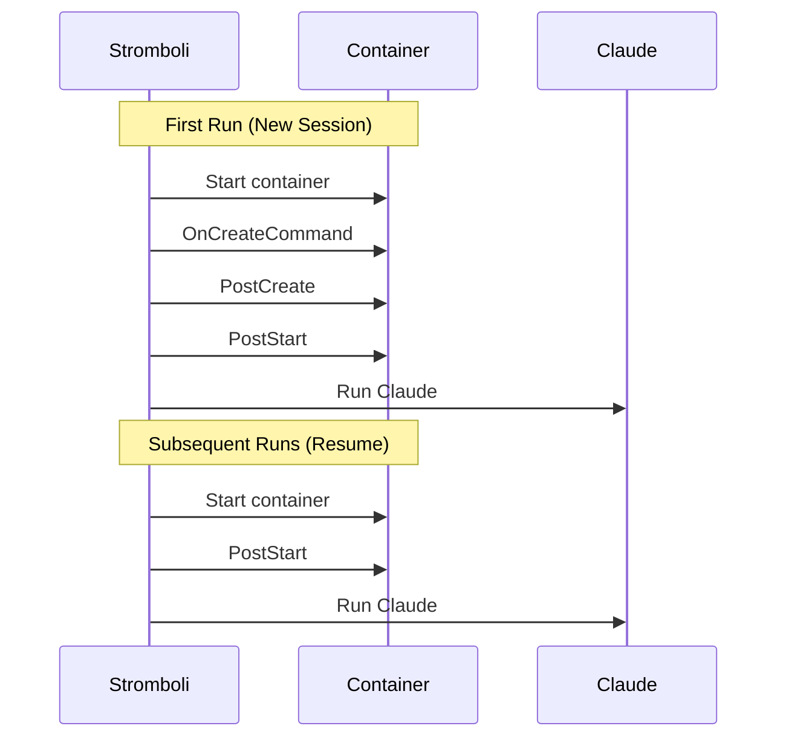
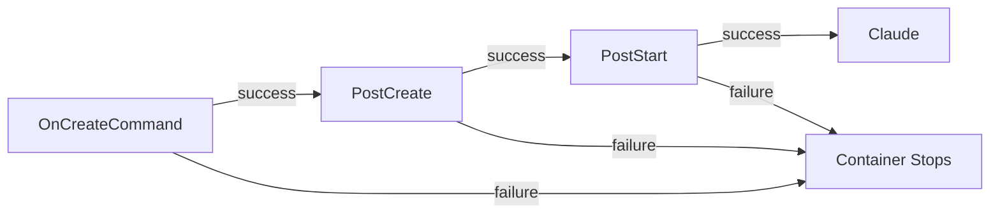

# Lifecycle Hooks

Lifecycle hooks allow you to run commands at specific stages of the container lifecycle. This is useful for installing dependencies, starting background services, or initializing the environment before Claude begins working.

## Hook Execution Order



| Hook | When It Runs | Use Case |
|------|--------------|----------|
| `on_create_command` | First run only, after container creation | Install dependencies, clone repos |
| `post_create` | First run only, after `on_create_command` | Build projects, run migrations |
| `post_start` | Every run (including resumes) | Start background services, set up environment |

## Basic Usage

```bash
curl -X POST http://localhost:8080/run \
  -H "Content-Type: application/json" \
  -d '{
    "prompt": "Run the Python tests",
    "workdir": "/workspace",
    "podman": {
      "image": "python:3.12",
      "volumes": ["/home/user/myproject:/workspace"],
      "lifecycle": {
        "on_create_command": ["pip install -r requirements.txt"],
        "post_start": ["redis-server --daemonize yes"]
      }
    }
  }'
```

## Hook Types

### OnCreateCommand

Runs **once** when a session is first created. Use this for one-time setup tasks.

```json
{
  "podman": {
    "lifecycle": {
      "on_create_command": [
        "apt-get update && apt-get install -y git curl",
        "pip install -r requirements.txt",
        "npm install"
      ]
    }
  }
}
```

**Common uses:**

- Installing system packages
- Installing language dependencies (pip, npm, go get)
- Cloning additional repositories
- Downloading data files

### PostCreate

Runs **once** after `on_create_command` completes. Use this for build steps that depend on installed dependencies.

```json
{
  "podman": {
    "lifecycle": {
      "on_create_command": ["npm install"],
      "post_create": [
        "npm run build",
        "npm run db:migrate"
      ]
    }
  }
}
```

**Common uses:**

- Building projects
- Running database migrations
- Generating configuration files
- Creating initial data

### PostStart

Runs **every time** the container starts, including when resuming a session. Use this for starting services or setting up the runtime environment.

```json
{
  "podman": {
    "lifecycle": {
      "post_start": [
        "redis-server --daemonize yes",
        "postgresql start",
        "export MY_VAR=value"
      ]
    }
  }
}
```

**Common uses:**

- Starting background services (Redis, PostgreSQL, etc.)
- Setting environment variables
- Refreshing credentials
- Health checks

## Timeout Configuration

By default, hooks run with the container's timeout. You can set a specific hooks timeout:

```json
{
  "podman": {
    "timeout": "30m",
    "lifecycle": {
      "hooks_timeout": "5m",
      "on_create_command": ["pip install -r requirements.txt"]
    }
  }
}
```

This prevents long-running hooks from consuming the main execution timeout.

## Idempotency Requirement

!!! warning "Design Hooks to be Idempotent"
    Init hooks (`on_create_command`, `post_create`) may run again if the first attempt crashes before completion. Design hooks to be safe to re-run.

**Good (idempotent):**
```json
{
  "on_create_command": [
    "pip install -r requirements.txt",
    "npm ci"
  ]
}
```

**Bad (not idempotent):**
```json
{
  "on_create_command": [
    "pip install -r requirements.txt && rm -rf /root/.cache",
    "echo 'data' >> /app/config"
  ]
}
```

The bad examples might fail or produce unexpected results on re-run because:
- Cache is deleted, causing reinstall to potentially fail offline
- Data is appended multiple times to the config file

## Fail-Fast Behavior

Hooks are chained with `&&`. If any hook command fails, subsequent hooks and the main Claude command will **not** run.



## Examples

### Python Development Environment

```json
{
  "prompt": "Fix the failing tests in tests/unit/",
  "workdir": "/workspace",
  "podman": {
    "image": "python:3.12",
    "volumes": ["/home/user/myproject:/workspace"],
    "lifecycle": {
      "on_create_command": [
        "pip install -r requirements.txt",
        "pip install -r requirements-dev.txt"
      ],
      "post_start": [
        "export PYTHONPATH=/workspace"
      ]
    }
  }
}
```

### Node.js with Database

```json
{
  "prompt": "Add a new API endpoint for user preferences",
  "workdir": "/app",
  "podman": {
    "image": "node:20",
    "volumes": ["/home/user/webapp:/app"],
    "lifecycle": {
      "on_create_command": [
        "npm ci"
      ],
      "post_create": [
        "npm run build",
        "npm run db:migrate"
      ],
      "post_start": [
        "npm run db:start &"
      ],
      "hooks_timeout": "10m"
    }
  }
}
```

### Go Project with Redis

```json
{
  "prompt": "Implement caching for the user service",
  "workdir": "/workspace",
  "podman": {
    "image": "golang:1.22",
    "volumes": ["/home/user/goproject:/workspace"],
    "lifecycle": {
      "on_create_command": [
        "apt-get update && apt-get install -y redis-server",
        "go mod download"
      ],
      "post_start": [
        "redis-server --daemonize yes"
      ]
    }
  }
}
```

### Multi-Tool Environment

```json
{
  "prompt": "Review and refactor the microservices",
  "workdir": "/workspace",
  "podman": {
    "image": "ubuntu:22.04",
    "volumes": ["/home/user/services:/workspace"],
    "lifecycle": {
      "on_create_command": [
        "apt-get update",
        "apt-get install -y curl git python3 python3-pip nodejs npm golang",
        "pip3 install -r requirements.txt || true",
        "npm install || true",
        "go mod download || true"
      ],
      "hooks_timeout": "15m"
    }
  }
}
```

## Session Continuation

When resuming a session with `resume: true`, only `post_start` hooks run:

```bash
# First request - all hooks run
curl -X POST http://localhost:8080/run \
  -d '{
    "prompt": "Set up the project",
    "podman": {
      "lifecycle": {
        "on_create_command": ["npm install"],
        "post_start": ["npm run dev &"]
      }
    }
  }'

# Response: {"session_id": "abc123", ...}

# Resume request - only post_start runs
curl -X POST http://localhost:8080/run \
  -d '{
    "prompt": "Now add unit tests",
    "claude": {
      "session_id": "abc123",
      "resume": true
    },
    "podman": {
      "lifecycle": {
        "on_create_command": ["npm install"],
        "post_start": ["npm run dev &"]
      }
    }
  }'
```

This ensures that:
- Dependencies aren't reinstalled on every request
- Services are started fresh on each container start
- The environment is consistent across runs

## Security Considerations

!!! danger "Hook Security"
    Hooks run with the same privileges as the container. Be careful with:

    - Commands that modify system files
    - Scripts from untrusted sources
    - Commands that expose sensitive data

**Validation rules:**

| Rule | Limit |
|------|-------|
| Max args per command | 100 |
| Max arg length | 4096 characters |
| Max total hook size | 65536 characters |
| Max total args across hooks | 200 |
| Max hooks timeout | 1 hour |

All hook arguments are shell-escaped to prevent injection attacks.

## Troubleshooting

### Hook Command Failed

**Symptom:** Request fails with hook error

**Check:**
1. The command exists in the container image
2. Dependencies are installed in order
3. Working directory exists

```bash
# Test your hooks manually
podman run -it python:3.12 sh -c "pip install -r requirements.txt"
```

### Timeout Exceeded

**Symptom:** Request times out during hooks

**Solution:** Increase `hooks_timeout`:

```json
{
  "lifecycle": {
    "hooks_timeout": "15m",
    "on_create_command": ["pip install tensorflow"]
  }
}
```

### Service Not Available on Resume

**Symptom:** Background service not running when resuming session

**Solution:** Ensure the service is started in `post_start`, not just `on_create_command`:

```json
{
  "lifecycle": {
    "on_create_command": ["apt-get install -y redis-server"],
    "post_start": ["redis-server --daemonize yes"]
  }
}
```

## Next Steps

- [Running Agents](running-agents.md) - Core agent documentation
- [Sessions](sessions.md) - Session management
- [Compose Environments](compose-environments.md) - Multi-service environments
