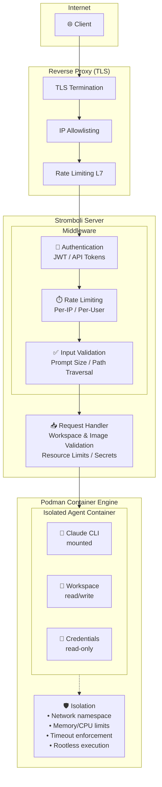
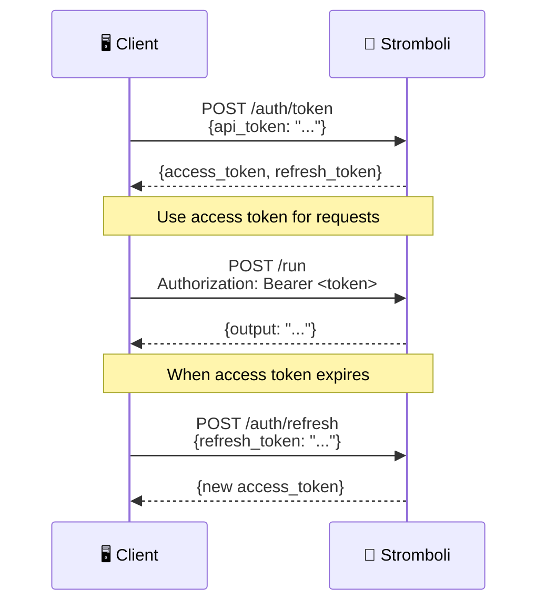

# Security Guide

Comprehensive security documentation for deploying and operating Stromboli safely.

## Security Architecture



## Threat Model

### Attack Surface

| Component | Threats | Mitigations |
|-----------|---------|-------------|
| **API Endpoint** | Unauthorized access, DoS | Authentication, rate limiting, TLS |
| **Prompts** | Injection, excessive length | Input validation, size limits |
| **Workspaces** | Path traversal, data exfiltration | Allowlist, path validation |
| **Containers** | Escape, resource exhaustion | Rootless Podman, limits |
| **Credentials** | Token theft, replay attacks | Short TTL, secure storage |
| **Secrets** | Exposure, unauthorized access | Podman secrets, read-only mount |

### Trust Boundaries

1. **External → API**: Untrusted. Requires authentication and validation.
2. **API → Container**: Semi-trusted. Validated but isolated.
3. **Container → Host**: Untrusted. Sandboxed via Podman.
4. **Container → Workspace**: Controlled. Limited to allowed paths.

## Authentication

### JWT Authentication (Recommended)

JWT provides stateless, scalable authentication:

```yaml
# Configuration
auth:
  enabled: true

jwt:
  secret: "your-256-bit-secret"  # Generate with: openssl rand -base64 32
  access_expiry: "24h"
  refresh_expiry: "168h"  # 7 days
```

**Token Flow:**



**Best Practices:**

- Use short access token TTL (1-24 hours)
- Store refresh tokens securely (httpOnly cookies or secure storage)
- Implement token rotation on refresh
- Use logout endpoint to invalidate tokens

### API Token Authentication (Simple)

For simpler deployments or service-to-service communication:

```yaml
auth:
  enabled: true
  valid_tokens:
    - "service-a-token"
    - "service-b-token"
```

```bash
curl -H "X-API-Token: service-a-token" http://localhost:8080/run ...
```

!!! warning "API Token Security"
    API tokens don't expire. Use JWT for user-facing applications.

## Input Validation

### Prompt Validation

Stromboli validates all prompts:

- **Size limits**: Configurable max prompt length
- **Character validation**: UTF-8 encoding required
- **Rate limiting**: Prevents prompt flooding

### Workspace Security

Volume mounts give agents access to host directories:

```bash
# Mount host directory into container
curl -X POST http://localhost:8080/run \
  -d '{
    "prompt": "Analyze code",
    "workdir": "/workspace",
    "podman": {
      "volumes": ["/data/projects/myapp:/workspace:ro"]
    }
  }'
```

**Best practices:**

- Use read-only mounts (`:ro`) when analysis-only access is needed
- Mount specific directories, not entire home or root
- Avoid mounting sensitive directories (`~/.ssh`, `~/.aws`, `/etc`)
- Use separate volumes for input (read-only) and output (write)

### Image Validation

Control which container images can be used:

```yaml
agent:
  allowed_image_patterns:
    - "python:3.*"
    - "node:20*"
    - "ghcr.io/myorg/*"
```

Blocked by default:

- Alpine images (incompatible with Claude CLI)
- Distroless images
- Arbitrary registries (unless explicitly allowed)

## Container Isolation

### Rootless Podman

Stromboli uses rootless Podman for defense in depth:

```bash
# Containers run as unprivileged user
# Even if container escape occurs, attacker has limited privileges

# Enable rootless Podman
systemctl --user enable --now podman.socket
```

### Resource Limits

Prevent resource exhaustion attacks:

```yaml
resources:
  memory: "512m"      # Memory limit
  cpus: "1"           # CPU limit
  timeout: "30m"      # Execution timeout
```

Per-request overrides (within limits):

```bash
curl -X POST http://localhost:8080/run \
  -d '{
    "prompt": "Heavy task",
    "podman": {
      "memory": "2g",
      "cpus": "2",
      "timeout": "1h"
    }
  }'
```

### Network Isolation

Containers run in isolated network namespaces:

- No access to host network
- No access to other containers (by default)
- Internet access controlled via Podman network config

## Secrets Management

### Podman Secrets

Store sensitive data securely using Podman secrets:

```bash
# Create a secret
echo "github_pat_xxx" | podman secret create github-token -

# Use in request
curl -X POST http://localhost:8080/run \
  -d '{
    "prompt": "Clone and analyze repo",
    "podman": {
      "secrets_env": {
        "GITHUB_TOKEN": "github-token"
      }
    }
  }'
```

**Security Properties:**

- Secrets stored encrypted at rest
- Mounted read-only in container
- Never logged or exposed in API responses
- Separate from container filesystem

### Credential Protection

Claude credentials are protected:

```yaml
agent:
  credentials_file: "~/.claude/.credentials.json"
```

- Mounted read-only into containers
- Never copied, only bind-mounted
- Token caching reduces file reads

## Rate Limiting

Protect against abuse and DoS:

```yaml
rate_limit:
  enabled: true
  rate: 10        # Requests per second
  burst: 20       # Burst allowance
```

**Rate Limit Response:**

```json
HTTP/1.1 429 Too Many Requests
Retry-After: 1

{
  "error": "rate limit exceeded",
  "retry_after": 1
}
```

**Best Practices:**

- Enable in production
- Set appropriate limits for your use case
- Monitor rate limit hits
- Use per-user limits with authentication

## TLS/HTTPS

Always use TLS in production. Configure via reverse proxy:

### Traefik

```yaml
# docker-compose.yml
services:
  traefik:
    image: traefik:v2.10
    command:
      - "--providers.docker=true"
      - "--entrypoints.websecure.address=:443"
      - "--certificatesresolvers.letsencrypt.acme.tlschallenge=true"
      - "--certificatesresolvers.letsencrypt.acme.email=you@example.com"
      - "--certificatesresolvers.letsencrypt.acme.storage=/letsencrypt/acme.json"
    ports:
      - "443:443"
    volumes:
      - /var/run/docker.sock:/var/run/docker.sock:ro
      - ./letsencrypt:/letsencrypt

  stromboli:
    image: ghcr.io/tomblancdev/stromboli:latest
    labels:
      - "traefik.enable=true"
      - "traefik.http.routers.stromboli.rule=Host(`api.example.com`)"
      - "traefik.http.routers.stromboli.tls.certresolver=letsencrypt"
```

### Nginx

```nginx
server {
    listen 443 ssl http2;
    server_name api.example.com;

    ssl_certificate /etc/letsencrypt/live/api.example.com/fullchain.pem;
    ssl_certificate_key /etc/letsencrypt/live/api.example.com/privkey.pem;

    # Modern TLS configuration
    ssl_protocols TLSv1.2 TLSv1.3;
    ssl_ciphers ECDHE-ECDSA-AES128-GCM-SHA256:ECDHE-RSA-AES128-GCM-SHA256;
    ssl_prefer_server_ciphers off;

    # Security headers
    add_header Strict-Transport-Security "max-age=63072000" always;
    add_header X-Content-Type-Options "nosniff" always;
    add_header X-Frame-Options "DENY" always;

    location / {
        proxy_pass http://localhost:8080;
        proxy_set_header Host $host;
        proxy_set_header X-Real-IP $remote_addr;
        proxy_set_header X-Forwarded-For $proxy_add_x_forwarded_for;
        proxy_set_header X-Forwarded-Proto $scheme;
    }
}
```

## Audit Logging

### Structured Logs

Stromboli logs all requests in structured format:

```json
{
  "time": "2024-01-15T10:30:00Z",
  "level": "INFO",
  "msg": "Request completed",
  "method": "POST",
  "path": "/run",
  "status": 200,
  "duration_ms": 5432,
  "client_ip": "192.168.1.100",
  "user_id": "user-123",
  "session_id": "sess-abc",
  "workdir": "/workspace"
}
```

### What's Logged

| Event | Details Logged |
|-------|----------------|
| Authentication | Success/failure, user ID, IP |
| API Requests | Method, path, status, duration |
| Container Operations | Create, start, stop, timeout |
| Errors | Error type, message, stack trace |
| Rate Limits | IP, user, limit exceeded |

### What's NOT Logged

- Prompt contents (privacy)
- Response contents (privacy)
- Credentials/tokens (security)
- Secrets (security)

## Production Checklist

### Required

- [ ] **Enable authentication** - `STROMBOLI_AUTH_ENABLED=true`
- [ ] **Set JWT secret** - `STROMBOLI_JWT_SECRET=<random-256-bit>`
- [ ] **Enable TLS** - Use reverse proxy with HTTPS
- [ ] **Enable rate limiting** - `STROMBOLI_RATE_LIMIT_ENABLED=true`
- [ ] **Review volume mounts** - Audit what directories are mounted
- [ ] **Use rootless Podman** - Non-root container execution

### Recommended

- [ ] **Set resource limits** - Memory, CPU, timeout
- [ ] **Configure allowed images** - Restrict container images
- [ ] **Enable monitoring** - Prometheus metrics, logging
- [ ] **Set up alerts** - Error rates, rate limits, failures
- [ ] **Regular updates** - Keep Stromboli and images updated
- [ ] **Backup sessions** - If session persistence is important

### Network Security

- [ ] **Firewall** - Only expose necessary ports
- [ ] **Internal network** - Keep Stromboli behind reverse proxy
- [ ] **IP allowlisting** - If possible, restrict client IPs

## Security Contacts

Found a security issue? Please report responsibly:

1. **Do NOT** create public GitHub issues for security vulnerabilities
2. Email security concerns to the maintainers
3. Include reproduction steps and impact assessment
4. Allow reasonable time for patches before disclosure

## Related Documentation

- [Authentication API](../api/authentication.md) - JWT token endpoints
- [Configuration](../getting-started/configuration.md) - Security-related settings
- [Production Deployment](../deployment/production.md) - Deployment hardening
