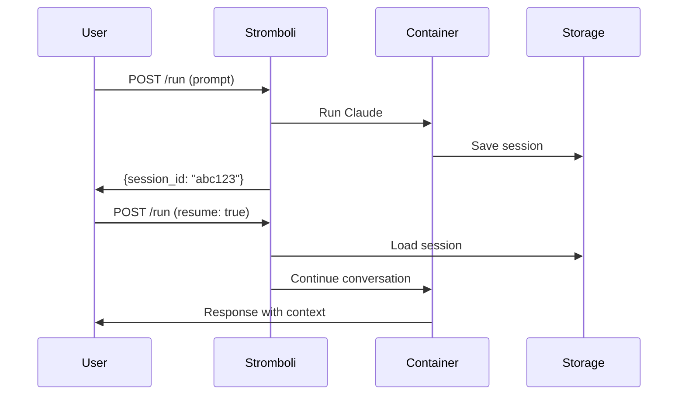

# Sessions

Sessions allow conversations to persist across multiple requests.

## How Sessions Work



## Creating a Session

Every request creates a new session by default:

```bash
curl -X POST http://localhost:8080/run \
  -d '{"prompt": "Hello, remember my name is Tom"}'
```

Response:
```json
{
  "output": "Hello Tom! Nice to meet you...",
  "session_id": "550e8400-e29b-41d4-a716-446655440000"
}
```

## Resuming a Session

Use the session ID to continue the conversation:

```bash
curl -X POST http://localhost:8080/run \
  -d '{
    "prompt": "What is my name?",
    "claude": {
      "session_id": "550e8400-e29b-41d4-a716-446655440000",
      "resume": true
    }
  }'
```

Response:
```json
{
  "output": "Your name is Tom!",
  "session_id": "550e8400-e29b-41d4-a716-446655440000"
}
```

## Session Options

### Resume vs Continue

| Option | Description |
|--------|-------------|
| `resume: true` | Continue specific session by ID |
| `continue: true` | Continue most recent session in workspace |

```bash
# Resume specific session
{"claude": {"session_id": "abc123", "resume": true}}

# Continue most recent
{"claude": {"continue": true}}
```

### Fork a Session

Create a new session from an existing one:

```bash
curl -X POST http://localhost:8080/run \
  -d '{
    "prompt": "Try a different approach",
    "claude": {
      "session_id": "abc123",
      "fork_session": true
    }
  }'
```

This creates a new session with the conversation history but a new ID.

### No Persistence

Run without saving the session:

```bash
curl -X POST http://localhost:8080/run \
  -d '{
    "prompt": "One-off question",
    "claude": {
      "no_persistence": true
    }
  }'
```

## Managing Sessions

### List Sessions

```bash
curl http://localhost:8080/sessions
```

Response:
```json
{
  "sessions": [
    "550e8400-e29b-41d4-a716-446655440000",
    "6ba7b810-9dad-11d1-80b4-00c04fd430c8"
  ]
}
```

### Get Session Messages

```bash
curl http://localhost:8080/sessions/550e8400.../messages
```

Response:
```json
{
  "messages": [
    {"role": "user", "content": "Hello"},
    {"role": "assistant", "content": "Hi there!"}
  ]
}
```

### Delete a Session

```bash
curl -X DELETE http://localhost:8080/sessions/550e8400...
```

Response:
```json
{
  "success": true,
  "session_id": "550e8400..."
}
```

## Session Storage

Sessions are stored in the directory configured by `STROMBOLI_AGENT_SESSIONS_DIR` (default: `./sessions`).

```
sessions/
├── 550e8400-e29b-41d4-a716-446655440000/
│   ├── .claude/
│   │   └── sessions/
│   └── ...
└── 6ba7b810-9dad-11d1-80b4-00c04fd430c8/
    └── ...
```

!!! tip "Cleanup"
    Periodically delete old sessions to free disk space:
    ```bash
    # Delete sessions older than 7 days
    find ./sessions -type d -mtime +7 -exec rm -rf {} \;
    ```
