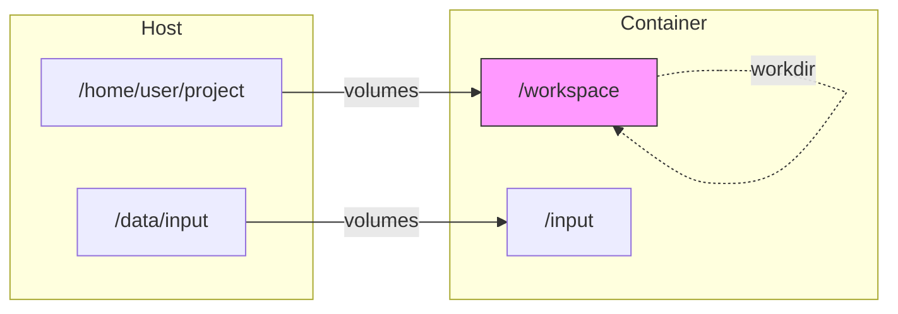

# Working Directory & Volumes

Configure where Claude agents work and what files they can access.

## Understanding Workdir vs Volumes

| Parameter | Purpose | Example |
|-----------|---------|---------|
| `workdir` | Container working directory where Claude spawns | `/workspace`, `/app` |
| `volumes` | Mount host paths into the container | `/host/code:/workspace:ro` |



## Basic Usage

### Set Working Directory

Use `workdir` to specify where Claude starts inside the container:

```bash
curl -X POST http://localhost:8080/run \
  -H "Content-Type: application/json" \
  -d '{
    "prompt": "List files in the current directory",
    "workdir": "/workspace"
  }'
```

### Mount Host Directories

Use `volumes` to mount host paths into the container:

```bash
curl -X POST http://localhost:8080/run \
  -H "Content-Type: application/json" \
  -d '{
    "prompt": "Analyze the code in this project",
    "workdir": "/workspace",
    "podman": {
      "volumes": ["/home/user/myproject:/workspace"]
    }
  }'
```

## Volume Format

```
host_path:container_path[:options]
```

| Component | Description | Example |
|-----------|-------------|---------|
| `host_path` | Absolute path on the host system | `/home/user/project` |
| `container_path` | Path inside the container | `/workspace` |
| `options` | Mount options (optional) | `ro`, `rw` |

### Examples

```bash
# Read-write mount (default)
"/home/user/code:/workspace"

# Read-only mount
"/home/user/data:/data:ro"

# Multiple volumes
"volumes": [
  "/home/user/project:/workspace",
  "/data/input:/input:ro",
  "/data/output:/output"
]
```

## Common Patterns

### Development Workflow

Mount your project and set it as the working directory:

```json
{
  "prompt": "Fix the failing tests",
  "workdir": "/workspace",
  "podman": {
    "volumes": ["/home/user/myproject:/workspace"]
  }
}
```

### Read-Only Analysis

Analyze code without modification risk:

```json
{
  "prompt": "Review this codebase for security issues",
  "workdir": "/code",
  "podman": {
    "volumes": ["/home/user/myproject:/code:ro"]
  }
}
```

### Separate Input/Output

Process data with clear boundaries:

```json
{
  "prompt": "Process all CSV files in /input and save results to /output",
  "workdir": "/workspace",
  "podman": {
    "volumes": [
      "/data/raw:/input:ro",
      "/data/processed:/output"
    ]
  }
}
```

### Custom Container Images

Use a specific image with your mounted code:

```json
{
  "prompt": "Run the Python tests",
  "workdir": "/app",
  "podman": {
    "image": "python:3.12",
    "volumes": ["/home/user/python-project:/app"]
  }
}
```

## Best Practices

### 1. Use Read-Only When Possible

```bash
# Good: Read-only for source code analysis
"volumes": ["/code:/workspace:ro"]

# Only use read-write when modifications are needed
"volumes": ["/code:/workspace"]
```

### 2. Use Absolute Paths

```bash
# Good
"volumes": ["/home/user/project:/workspace"]

# Bad - relative paths may not resolve correctly
"volumes": ["./project:/workspace"]
```

### 3. Limit Scope

```bash
# Good: Mount specific project
"volumes": ["/home/user/projects/myapp:/workspace"]

# Bad: Mount entire home directory
"volumes": ["/home/user:/workspace"]
```

### 4. Avoid Sensitive Directories

Never mount these paths:

- `/` (root filesystem)
- `/etc` (system configuration)
- `~/.ssh` (SSH keys)
- `~/.aws` (AWS credentials)
- `~/.config` (application secrets)

### 5. Separate Concerns

```json
{
  "volumes": [
    "/code:/workspace:ro",
    "/data:/data:ro",
    "/output:/output"
  ]
}
```

## Troubleshooting

### Files Not Visible

**Check the volume mount:**
```bash
# Verify the path exists on the host
ls -la /home/user/project

# Verify it's in your volumes array
"volumes": ["/home/user/project:/workspace"]
```

### Permission Denied

**Check file ownership:**
```bash
# Stromboli runs as your user, verify permissions
ls -la /home/user/project

# If needed, fix permissions
chmod -R u+rw /home/user/project
```

### Changes Not Persisted

**Check mount options:**
```bash
# If mounted read-only, changes won't persist
"volumes": ["/path:/workspace:ro"]  # Read-only!

# Remove :ro to allow writes
"volumes": ["/path:/workspace"]
```

### Container Can't Find Files

**Check workdir path matches volume:**
```json
{
  "workdir": "/app",
  "podman": {
    "volumes": ["/code:/workspace"]
  }
}
```

The workdir is `/app` but files are mounted at `/workspace`. Fix:

```json
{
  "workdir": "/workspace",
  "podman": {
    "volumes": ["/code:/workspace"]
  }
}
```

## Security: Volume Allowlist

By default, Stromboli allows mounting any host path. In production, configure an allowlist:

```bash
export STROMBOLI_AGENT_ALLOWED_VOLUMES="/home/user/projects,/data/workspaces"
```

Or in config file:
```yaml
agent:
  allowed_volumes:
    - /home/user/projects
    - /data/workspaces
```

**Rules:**

- If allowlist is empty → all paths allowed (default)
- If allowlist is configured → only those paths (and subdirectories) are allowed
- Path traversal (`../`) is blocked

```bash
# If /home/user/projects is allowed:
/home/user/projects           # ✅ Allowed
/home/user/projects/foo       # ✅ Allowed (subdirectory)
/home/user/other              # ❌ Denied
```

## Workdir Auto-Creation

By default, if the `workdir` path doesn't exist inside the container, Stromboli automatically creates it:

```json
{
  "workdir": "/my/custom/path",  // Auto-created if missing
  "podman": {
    "volumes": ["/host/data:/data"]
  }
}
```

This runs `mkdir -p /my/custom/path` before executing Claude.

To disable this behavior:

```bash
export STROMBOLI_AGENT_WORKDIR_AUTO_CREATE=false
```

Or in config file:
```yaml
agent:
  workdir_auto_create: false
```

## Security Considerations

!!! warning "Volume Mounting Risks"
    Mounting host directories gives Claude read/write access to those files.
    Always use read-only mounts (`:ro`) when analysis-only access is needed.

See the [Security Guide](security.md) for comprehensive security recommendations.
