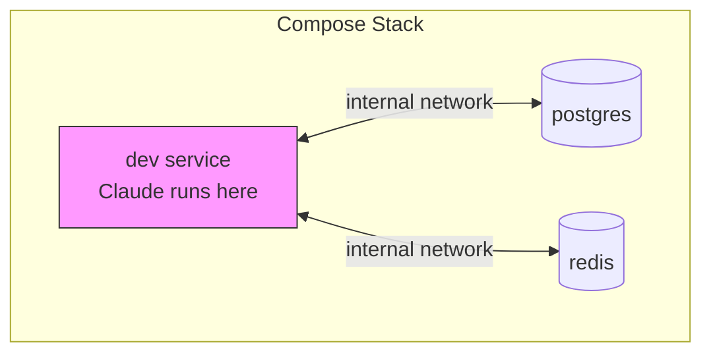

# Compose Environments

Run Claude in multi-service environments defined by Docker/Podman Compose files. This lets agents work alongside databases, caches, and other services.

## When to use compose

| Scenario | Single container | Compose |
|---|---|---|
| Code review / analysis | Preferred | Overkill |
| Full-stack development | Limited | **Recommended** |
| Integration testing | Limited | **Recommended** |
| Database operations | Not possible | **Required** |

## Overview



## Basic usage

### 1. Create a compose file

```yaml
# docker-compose.yml
services:
  dev:
    image: python:3.12
    working_dir: /workspace
    volumes:
      - .:/workspace
    depends_on:
      db:
        condition: service_healthy

  db:
    image: postgres:16
    environment:
      POSTGRES_PASSWORD: devpass
      POSTGRES_DB: myapp
    healthcheck:
      test: ["CMD-SHELL", "pg_isready -U postgres"]
      interval: 5s
      timeout: 5s
      retries: 5
```

### 2. Run Claude in the stack

```bash
curl -X POST localhost:8080/run \
  -d '{
    "prompt": "Set up the database schema",
    "workdir": "/workspace",
    "podman": {
      "environment": {
        "type": "compose",
        "path": "/home/user/myproject/docker-compose.yml",
        "service": "dev"
      }
    }
  }'
```

## Configuration

| Field | Type | Required | Description |
|---|---|---|---|
| `type` | string | Yes | Must be `"compose"` |
| `path` | string | Yes | Absolute path to compose file |
| `service` | string | Yes | Service where Claude runs |
| `build_timeout` | string | No | Override build timeout (default: 10m) |

Server-side compose settings:

```yaml
compose:
  allow_privileged: false    # default: false
  allow_host_network: false  # default: false
  allow_host_volumes: false  # default: false
  build_timeout: "10m"
  health_timeout: "2m"
  stack_ttl: "1h"
```

## Stack lifecycle

1. **Validate** — Compose file checked for security
2. **Build** — Services built if needed
3. **Start** — All services started
4. **Health check** — Wait for services to be healthy
5. **Execute** — Claude runs in the specified service

Stacks persist with sessions. Resuming a session reuses the same stack with data intact. Stacks are cleaned up when the session is deleted, the stack TTL expires, or Stromboli shuts down.

## Combining with lifecycle hooks

```bash
curl -X POST localhost:8080/run \
  -d '{
    "prompt": "Run the integration tests",
    "podman": {
      "environment": {
        "type": "compose",
        "path": "/home/user/project/docker-compose.yml",
        "service": "dev"
      },
      "lifecycle": {
        "on_create_command": ["pip install -r requirements.txt"],
        "post_start": ["./wait-for-db.sh"]
      }
    }
  }'
```

Hooks run inside the specified service container after the stack is healthy.

## Security

These compose configurations are **blocked by default**:

| Blocked config | Risk |
|---|---|
| `privileged: true` | Container escape |
| `cap_add: ALL/SYS_ADMIN` | Near-root access |
| `network_mode: host` | Network namespace escape |
| `ipc/pid: host` | Namespace sharing |
| `devices: [...]` | Device access |
| `seccomp/apparmor: unconfined` | Disabled security modules |
| Host volume mounts | Filesystem access |

Named volumes are always allowed:

```yaml
services:
  db:
    volumes:
      - pgdata:/var/lib/postgresql/data  # allowed

volumes:
  pgdata:
```

## Best practices

1. **Add health checks** to all services so Stromboli knows when they're ready
2. **Use `depends_on` with `condition: service_healthy`** for reliable startup order
3. **Use named volumes** for persistent data (host mounts are blocked by default)
4. **Keep compose files simple** — fewer services, pre-built images when possible
5. **Set reasonable build timeouts** for services that need compilation

## Troubleshooting

**Stack failed to start** — Test locally: `podman compose -f /path/to/compose.yml up`

**Health check timeout** — Add health checks to services or increase `STROMBOLI_COMPOSE_HEALTH_TIMEOUT`.

**Service not found** — Make sure the `service` field matches a service name in your compose file.

**Security validation failed** — Remove the blocked configuration or (not recommended) enable the corresponding `allow_*` flag.
