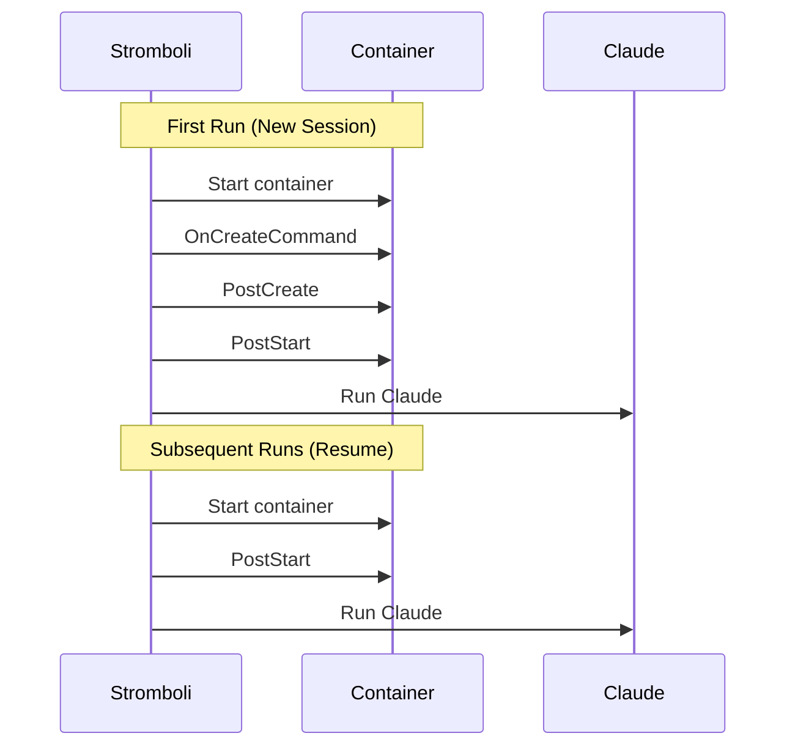
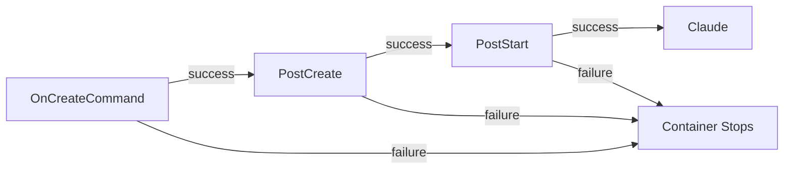

# Lifecycle Hooks

Run commands at specific stages of the container lifecycle — install dependencies, start background services, or set up the environment before Claude begins working.

## Hook execution order



| Hook | Runs when | Use for |
|---|---|---|
| `on_create_command` | First run only | Installing dependencies, cloning repos |
| `post_create` | First run only, after on_create | Building projects, running migrations |
| `post_start` | Every run (including resumes) | Starting services, setting env vars |

## Basic usage

```bash
curl -X POST localhost:8080/run \
  -d '{
    "prompt": "Run the tests",
    "workdir": "/workspace",
    "podman": {
      "image": "python:3.12",
      "volumes": ["/home/user/myproject:/workspace"],
      "lifecycle": {
        "on_create_command": ["pip install -r requirements.txt"],
        "post_start": ["redis-server --daemonize yes"]
      }
    }
  }'
```

## Examples

### Python project

```json
{
  "podman": {
    "image": "python:3.12",
    "lifecycle": {
      "on_create_command": [
        "pip install -r requirements.txt",
        "pip install -r requirements-dev.txt"
      ],
      "post_start": ["export PYTHONPATH=/workspace"]
    }
  }
}
```

### Node.js with database

```json
{
  "podman": {
    "image": "node:20",
    "lifecycle": {
      "on_create_command": ["npm ci"],
      "post_create": ["npm run build", "npm run db:migrate"],
      "post_start": ["npm run db:start &"],
      "hooks_timeout": "10m"
    }
  }
}
```

### Go with Redis

```json
{
  "podman": {
    "image": "golang:1.22",
    "lifecycle": {
      "on_create_command": [
        "apt-get update && apt-get install -y redis-server",
        "go mod download"
      ],
      "post_start": ["redis-server --daemonize yes"]
    }
  }
}
```

## Timeout

Set a specific timeout for hooks so they don't eat into the main execution timeout:

```json
{
  "podman": {
    "timeout": "30m",
    "lifecycle": {
      "hooks_timeout": "5m",
      "on_create_command": ["pip install -r requirements.txt"]
    }
  }
}
```

## Fail-fast behavior

Hooks are chained with `&&`. If any command fails, subsequent hooks and Claude **do not run**.



## Session continuation

When you resume a session, only `post_start` hooks run. `on_create_command` and `post_create` are skipped since dependencies are already installed.

This means:
- Put dependency installation in `on_create_command` (runs once)
- Put service startup in `post_start` (runs every time)

## Idempotency

!!! warning "Design hooks to be safe to re-run"
    Init hooks may run again if the first attempt crashes. Use idempotent commands like `pip install` and `npm ci` rather than commands that fail or produce side effects on re-run.

## Security

| Limit | Value |
|---|---|
| Max args per command | 100 |
| Max arg length | 4,096 chars |
| Max total hook size | 65,536 chars |
| Max total args | 200 |
| Max timeout | 1 hour |

All hook arguments are shell-escaped to prevent injection.

## Troubleshooting

**Hook command failed** — Check the command exists in the image. Test manually: `podman run -it python:3.12 sh -c "your command"`

**Timeout exceeded** — Increase `hooks_timeout` in the lifecycle config.

**Service not available on resume** — Move service startup to `post_start` instead of `on_create_command`.
