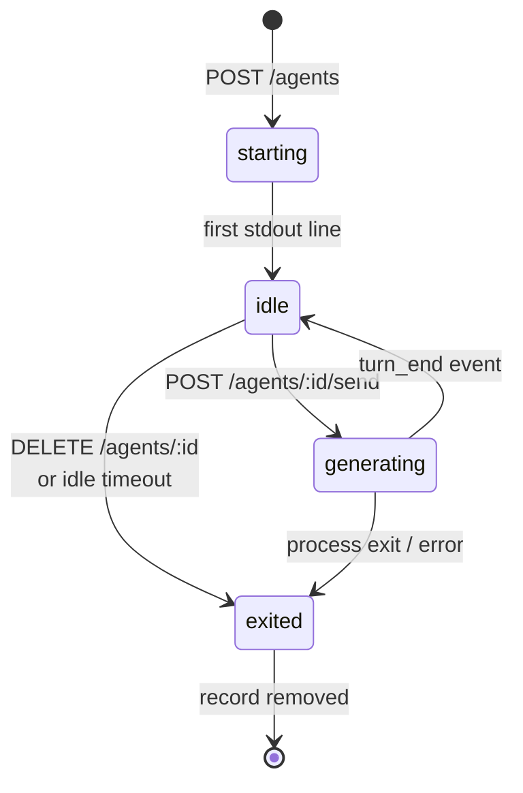

# Persistent Agents

A persistent agent is a long-lived Claude process kept alive across many turns. Once spawned, it accepts prompts via `POST /agents/{id}/send`, streams output via Server-Sent Events on `GET /agents/{id}/stream`, and stays warm until you delete it or its idle timeout fires.

## When to use one

Use a persistent agent when:

- **Latency matters per-turn.** `/run` cold-starts a container on every call (2–3 s). A warm agent answers in sub-second.
- **The conversation has many short turns.** On-call bots, Slack assistants, sensor-bus reactors — anything event-driven where the next turn arrives in seconds.
- **You want streaming output by default.** SSE is built in; clients consume `output` / `turn_start` / `turn_end` events as they happen.

Use plain `/run` (or `/run/async`) instead when:

- The work is one-shot ("review this PR"). Spawning + tearing down per request is fine.
- You don't have a place to keep an agent ID alive between requests.
- You need to lock down resource usage to a single bounded execution.

## Lifecycle

A persistent agent moves through four states:



| Status | What it means |
|---|---|
| `starting` | Container booting; Claude hasn't reported readiness yet. `/send` returns `503`. |
| `idle` | Alive and ready for the next turn. |
| `generating` | A turn is in flight. Concurrent `/send` returns `409`. |
| `exited` | Process or container has stopped. Record persists briefly so you can read `exit_error`. |

## Spawning

```bash
curl -X POST localhost:8080/agents \
  -H "Content-Type: application/json" \
  -d '{
    "prompt": "You are an on-call assistant. Wait for incident reports.",
    "workdir": "/workspace",
    "idle_timeout_seconds": 1800,
    "claude": {
      "model": "sonnet",
      "allowed_tools": ["Read", "Bash", "Grep"]
    }
  }'
```

```json
{
  "id": "agent-abc123",
  "session_id": "550e8400-...",
  "status": "starting",
  "idle_timeout_seconds": 1800,
  "turns_completed": 0,
  "created_at": "2026-05-01T08:00:00Z"
}
```

| Field | Required | Notes |
|---|---|---|
| `prompt` | no | Sent as the first turn. Omit for an "empty" agent that waits for `/send`. |
| `workdir` | no | Working directory inside the container, same semantics as `/run`. |
| `idle_timeout_seconds` | no | Override the manager-wide default. `0` keeps the default (30 min). Negative values are rejected. |
| `claude` | no | Same `ClaudeOptions` shape as `/run`. Pick model, tools, system prompt, etc. |

The same `claude` schema means a working `/run` request body almost copy-pastes into `/agents` — there's no second schema to learn.

## Sending turns

```bash
curl -X POST localhost:8080/agents/agent-abc123/send \
  -H "Content-Type: application/json" \
  -d '{"prompt": "What is the status of incident INC-417?"}'
```

```json
{"turn_id": "turn-def456"}
```

`/send` returns immediately with the new turn's ID. Output streams via `/stream` (next section). The agent stays in `generating` until the turn completes.

If you send while a turn is already running you get `409 Conflict (ErrAgentBusy)`. If the agent has exited you get `410 Gone (ErrAgentExited)`. If it hasn't booted yet you get `503 (ErrAgentNotReady)`.

## Streaming output

Open one SSE connection per agent (or per UI tab) and read events as they arrive:

```bash
curl -N localhost:8080/agents/agent-abc123/stream
```

```
event: turn_start
data: {"type":"turn_start","turn_id":"turn-def456","at":"2026-05-01T08:00:01Z"}

event: output
data: {"type":"output","turn_id":"turn-def456","content":"Looking at INC-417...","at":"..."}

event: output
data: {"type":"output","turn_id":"turn-def456","content":"...","at":"..."}

event: turn_end
data: {"type":"turn_end","turn_id":"turn-def456","at":"..."}
```

Event types:

- `turn_start` — fires when `/send` accepts a new turn
- `output` — one event per Claude stdout line (verbatim, you decide whether it's stream-json that needs parsing)
- `turn_end` — turn completed cleanly
- `error` — Claude wrote to stderr or a turn errored
- `exited` — agent's process has stopped; the channel will close after this
- `closed` — fired when your subscription ends because the agent was deleted

Multiple subscribers per agent are fine — each gets its own buffered channel. Slow subscribers may drop events (capacity 32 per subscriber); a dropped event is the contract trade-off for not letting one stuck client stall the whole agent.

!!! tip "Reconnects"
    SSE clients should reconnect on transient drops. Stromboli does not replay missed events — when you reconnect, you start at the next event. If you need full transcript replay, fetch `GET /sessions/{session_id}/messages` separately.

## Idle timeout

Each agent tracks `last_activity_at` (updated on every `/send`). A background watchdog wakes every 30 s; if `last_activity_at` is older than `idle_timeout_seconds`, the agent is stopped automatically and an `exited` event is fanned out with the error `agent: idle timeout reached`.

This is the cost-control gate. A forgotten agent eats container memory and the Claude budget; the timeout makes "leak by leaving" hard.

Pick the timeout to match your workload:

- Chat-style assistant where prompts arrive every few minutes → 30 min (default) is fine
- On-call agent that may sit silent for an hour between alerts → 2–4 hours
- High-frequency sensor reactor where prompts are seconds apart → 5–15 min is tighter and cheaper

The watchdog ticks every 30 s, so the actual stop time is `idle_timeout_seconds + (0..30s)`.

### Disabling the watchdog entirely

For service-style deployments where your code owns the agent's lifecycle and explicitly calls `DELETE /agents/{id}` at shutdown, set `disable_idle_timeout: true`:

```json
{
  "prompt": "...",
  "disable_idle_timeout": true,
  "claude": {"model": "sonnet"}
}
```

The watchdog goroutine isn't started; the agent runs until DELETE or server shutdown. The Snapshot returned by `GET /agents/{id}` includes `"idle_timeout_disabled": true` so observability tooling can flag long-lived agents.

!!! warning "You lose the safety net"
    With the watchdog off, an agent that's "forgotten" by buggy caller code will run indefinitely — eating container memory and Claude budget. Stromboli logs a loud `WARN` on spawn (`agent created with idle timeout DISABLED — caller owns lifecycle...`) so the override is visible. Use this only when the lifecycle is genuinely external to the agent (e.g. a long-running sidecar bot tied to your service's main process).

## Deleting

```bash
curl -X DELETE localhost:8080/agents/agent-abc123
```

`204 No Content` on success, `404` if the agent doesn't exist (already deleted or never spawned).

`DELETE` sends `SIGTERM` to the process group, waits 5 s for graceful exit, then `SIGKILL`. Subscribers get a final `exited` event, their SSE channels close, and the registry forgets the agent.

## Worked example: an on-call bot

```python
import requests, sseclient

# 1. Spawn once, at service start
r = requests.post("http://localhost:8080/agents", json={
    "prompt": "You triage incidents. Reply with severity (P0..P3) and one-line diagnosis.",
    "idle_timeout_seconds": 14400,  # 4h
    "claude": {"model": "sonnet"},
}).json()
agent_id = r["id"]

# 2. One streaming consumer for the whole service lifetime
def consume():
    with requests.get(f"http://localhost:8080/agents/{agent_id}/stream", stream=True) as resp:
        for ev in sseclient.SSEClient(resp).events():
            if ev.event == "output":
                print(ev.data)
            elif ev.event == "exited":
                break

# 3. Per-incident: just /send, no spawn cost
def triage(report: str) -> str:
    return requests.post(
        f"http://localhost:8080/agents/{agent_id}/send",
        json={"prompt": report},
    ).json()["turn_id"]

# 4. Tear down at SIGTERM
def shutdown():
    requests.delete(f"http://localhost:8080/agents/{agent_id}")
```

A single agent handles every incident the service receives. Cold start happens once at boot, then triages run in milliseconds.

## Operational notes

- **One container per agent.** Each agent holds a podman container open for its full lifetime. Capacity-plan accordingly: 100 simultaneous agents = 100 containers.
- **No multi-process safety.** The `Manager` is process-local. If you horizontally scale Stromboli, each replica has its own agent registry — operators should pin a given agent's traffic to the replica that spawned it (e.g. via session affinity), or use a single replica for the agent fleet.
- **Graceful shutdown.** On `SIGTERM`, Stromboli calls `StopAll()` and waits for every agent's process group to exit before the API server closes — you won't leak orphan podman containers.
- **Inspecting state.** `GET /agents` lists every agent and its snapshot; `GET /agents/{id}` returns one. Both are read-only and cheap.

## See also

- [API endpoints reference](../api/endpoints.md#persistent-agents) — full request/response shapes
- [Sessions](sessions.md) — every agent has a session under the hood; transcript retrieval works the same way
- [Lifecycle hooks](lifecycle-hooks.md) — agents honour the same `OnCreateCommand` / `PostCreate` / `PostStart` hooks that `/run` does
