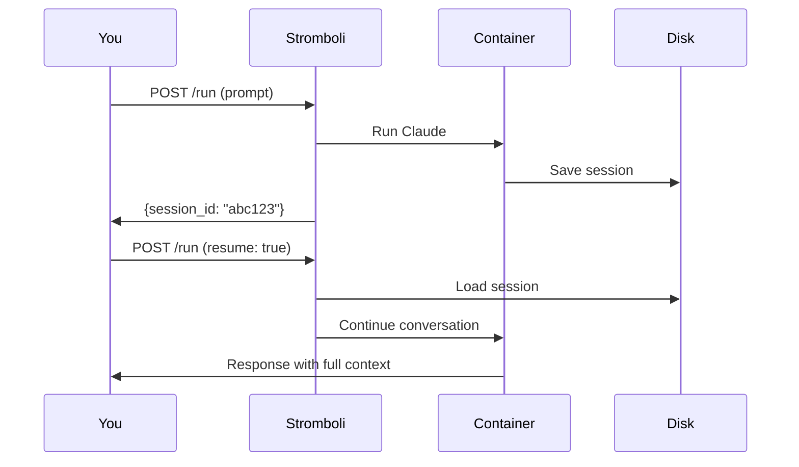
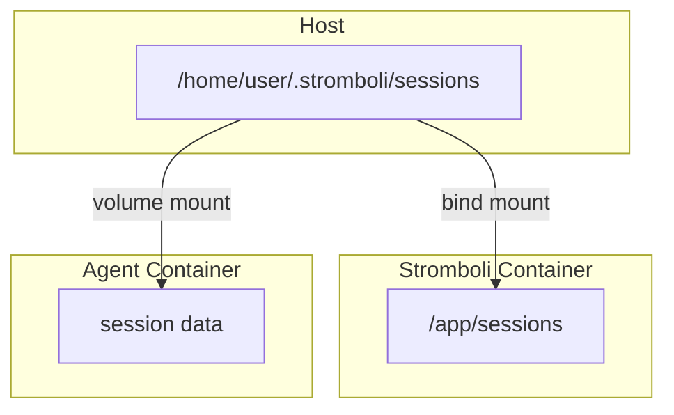

# Sessions

Sessions let you continue conversations across multiple requests. Every agent run creates a session by default.

## How sessions work



## Creating a session

Every request creates a session automatically:

```bash
curl -X POST localhost:8080/run \
  -d '{"prompt": "Hello, remember my name is Tom"}'
```

```json
{
  "output": "Hello Tom! Nice to meet you...",
  "session_id": "550e8400-e29b-41d4-a716-446655440000"
}
```

## Resuming a session

Pass the `session_id` back to pick up where you left off:

```bash
curl -X POST localhost:8080/run \
  -d '{
    "prompt": "What is my name?",
    "claude": {
      "session_id": "550e8400-e29b-41d4-a716-446655440000",
      "resume": true
    }
  }'
```

## Session options

| Option | What it does |
|---|---|
| `resume: true` | Continue a specific session by ID |
| `continue: true` | Continue the most recent session in the workspace |
| `fork_session: true` | Create a new session branched from an existing one |
| `no_persistence: true` | Run without saving any session data |

```bash
# Resume specific session
{"claude": {"session_id": "abc123", "resume": true}}

# Continue most recent
{"claude": {"continue": true}}

# Fork from existing
{"claude": {"session_id": "abc123", "fork_session": true}}

# One-off, no session saved
{"claude": {"no_persistence": true}}
```

## Managing sessions

```bash
# List all sessions
curl localhost:8080/sessions

# Get conversation messages
curl localhost:8080/sessions/550e8400.../messages

# Delete a session
curl -X DELETE localhost:8080/sessions/550e8400...
```

## Session storage

Sessions are stored at the path set by `STROMBOLI_AGENT_SESSIONS_DIR` (default: `.stromboli/sessions`).

```
sessions/
├── 550e8400-e29b-41d4-a716-446655440000/
│   ├── .claude/
│   │   └── projects/
│   └── .claude.json
└── 6ba7b810-9dad-11d1-80b4-00c04fd430c8/
    └── ...
```

Clean up old sessions periodically:

```bash
find ./sessions -type d -mtime +7 -exec rm -rf {} \;
```

## Containerized deployment

When Stromboli runs in a container, session directories need two paths because Stromboli creates them inside its container, but agent containers mount them from the host.

```yaml
services:
  stromboli:
    volumes:
      - /home/user/.stromboli/sessions:/app/sessions
    environment:
      STROMBOLI_AGENT_SESSIONS_DIR: "/app/sessions"
      STROMBOLI_AGENT_SESSIONS_HOST_DIR: "/home/user/.stromboli/sessions"
      STROMBOLI_AGENT_ALLOWED_VOLUMES: "/home/user/projects,/home/user/.stromboli/sessions"
```



If `SESSIONS_HOST_DIR` is not set, it defaults to `SESSIONS_DIR`. This only works when running Stromboli directly on the host.
