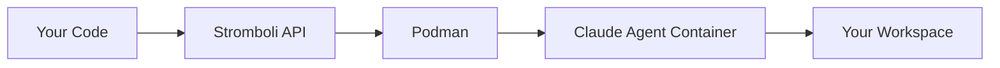

# Stromboli

<p align="center">
  <strong>Container orchestration API for Claude Code agents</strong>
</p>

<p align="center">
  <a href="getting-started/quickstart/">Get Started</a> •
  <a href="concepts/how-it-works/">How It Works</a> •
  <a href="api/overview/">API Reference</a> •
  <a href="https://github.com/tomblancdev/stromboli">GitHub</a>
</p>

---

## What is Stromboli?

Stromboli wraps [Claude Code](https://claude.ai/claude-code) in isolated Podman containers and exposes a REST API to spawn, manage, and orchestrate agents. You send a prompt over HTTP, Stromboli runs Claude in a sandboxed container with your code mounted, and returns the result.



## Why Stromboli?

**Isolation.** Each agent runs in its own container with resource limits, volume allowlists, and network isolation. A runaway agent can't touch your host.

**Any runtime.** Use Python, Node, Go, or any Docker image as the agent's environment. Need a database? Use [compose environments](guides/compose-environments.md).

**API-driven.** Spawn agents from CI/CD pipelines, webhooks, scripts, or any HTTP client. No CLI needed.

Want the full picture? Read [why Stromboli](concepts/containers-vs-worktrees.md).

## Quick example

```bash
curl -X POST http://localhost:8080/run \
  -H "Content-Type: application/json" \
  -d '{
    "prompt": "Analyze this Go project and suggest improvements",
    "workdir": "/workspace",
    "podman": {
      "volumes": ["/home/user/myproject:/workspace"]
    }
  }'
```

```json
{
  "id": "run-abc123",
  "status": "completed",
  "output": "I've analyzed the project...",
  "session_id": "550e8400-e29b-41d4-a716-446655440000"
}
```

## Features

<div class="grid cards" markdown>

- :material-docker: **Container Isolation**

    Each agent runs in its own Podman container with resource limits.

- :material-key: **Secrets Management**

    Inject tokens (GitHub, GitLab, etc.) via Podman's native secret store.

- :material-history: **Session Persistence**

    Continue conversations across requests with session management.

- :material-api: **REST API**

    HTTP API for spawning agents, managing jobs, and streaming output.

- :material-play-circle: **Lifecycle Hooks**

    Install dependencies and start services before Claude runs.

- :material-layers: **Compose Environments**

    Multi-service stacks with databases, caches, and more.

- :material-clock-fast: **Persistent Agents**

    Long-lived Claude processes for [event-driven workloads](guides/persistent-agents.md) — sub-second turn latency.

- :material-shield-check: **Signed Webhooks**

    HMAC-SHA256 callbacks so receivers can [verify authenticity](guides/webhook-security.md).

</div>

## Talk to it from your stack

Pick the [SDK or integration](sdks.md) that fits your runtime — all four track this server's OpenAPI spec automatically:

- [**stromboli-go**](https://github.com/tomblancdev/stromboli-go) — idiomatic Go client
- [**stromboli-ts**](https://github.com/tomblancdev/stromboli-ts) — TypeScript / JavaScript SDK
- [**mcp-server-stromboli**](https://github.com/tomblancdev/mcp-server-stromboli) — MCP server for Claude Desktop / Cursor / any MCP client
- **n8n-nodes-stromboli** — n8n community node _(coming soon)_

Or hit the [REST API](api/endpoints.md) directly — it's just HTTP + JSON.

## Get started

```bash
curl -sL https://raw.githubusercontent.com/tomblancdev/stromboli/main/install.sh | bash
cd stromboli
docker compose up -d
curl http://localhost:8080/health
```

Then head to the [quick start guide](getting-started/quickstart.md) to run your first agent.

## License

Stromboli is open source under the MIT License.
