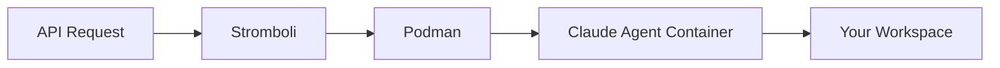

# Stromboli

<p align="center">
  <strong>Container orchestration API for Claude Code agents</strong>
</p>

<p align="center">
  <a href="getting-started/quickstart/">Get Started</a> •
  <a href="api/overview/">API Reference</a> •
  <a href="https://github.com/tomblancdev/stromboli">GitHub</a>
</p>

---

## What is Stromboli?

Stromboli is a **container orchestration API** that spawns and manages isolated [Claude Code](https://claude.ai/claude-code) agents in Podman containers. It's the Podman-based alternative to Pinocchio.



## Key Features

<div class="grid cards" markdown>

- :material-docker: **Container Isolation**

    Each agent runs in its own isolated Podman container with resource limits.

- :material-key: **Secrets Management**

    Securely inject tokens (GitHub, GitLab, etc.) as environment variables.

- :material-history: **Session Persistence**

    Continue conversations across requests with session management.

- :material-api: **REST API**

    Simple HTTP API for spawning agents, managing jobs, and streaming output.

- :material-shield-check: **Security First**

    Input validation, workspace allowlists, and credential isolation.

- :material-cog: **Configurable**

    Resource limits, timeouts, custom images, and more.

</div>

## Quick Example

```bash
# Run a Claude agent
curl -X POST http://localhost:8080/run \
  -H "Content-Type: application/json" \
  -d '{
    "prompt": "Analyze this Go project and suggest improvements",
    "workspace": "/home/user/myproject"
  }'
```

Response:
```json
{
  "id": "run-abc123",
  "status": "completed",
  "output": "I've analyzed the project...",
  "session_id": "550e8400-e29b-41d4-a716-446655440000"
}
```

## Installation

=== "Docker Compose (Recommended)"

    ```bash
    git clone https://github.com/tomblancdev/stromboli
    cd stromboli
    docker compose up -d
    ```

=== "From Source"

    ```bash
    git clone https://github.com/tomblancdev/stromboli
    cd stromboli
    make build
    ./stromboli
    ```

## Next Steps

- [Quick Start Guide](getting-started/quickstart.md) - Get up and running in 5 minutes
- [Configuration](getting-started/configuration.md) - Customize Stromboli for your needs
- [API Reference](api/overview.md) - Complete API documentation
- [Secrets Guide](guide/secrets.md) - Inject tokens securely

## License

Stromboli is open source under the MIT License.
