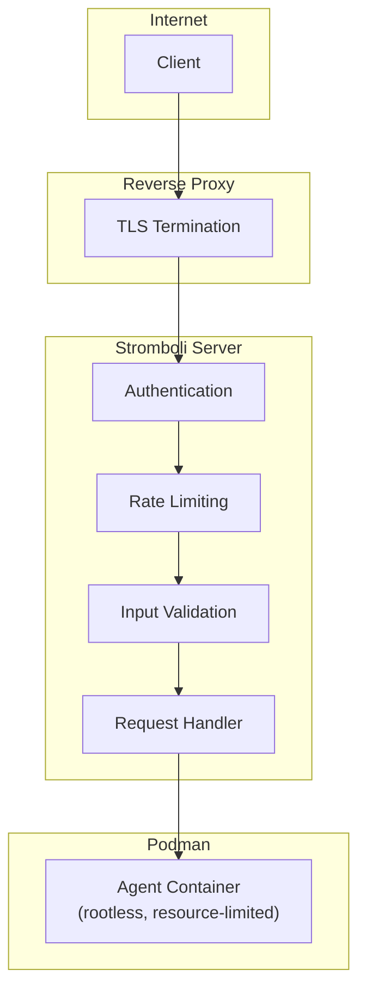

# Security Overview

Stromboli's security model assumes every API request is potentially hostile. Multiple layers validate, restrict, and isolate before anything touches a container.

## Architecture



## Threat model

| Attack surface | Threats | Mitigations |
|---|---|---|
| API endpoint | Unauthorized access, DoS | Authentication, rate limiting, TLS |
| Prompts | Injection, excessive length | Size limits, UTF-8 validation |
| Volume mounts | Path traversal, data exfiltration | Default-deny allowlist, symlink resolution |
| Containers | Escape, resource exhaustion | Rootless Podman, resource limits, timeouts |
| Secrets | Theft, unauthorized access | Podman secret store, read-only mounts |
| Compose files | Privilege escalation | Blocked configs (privileged, host network, etc.) |

### Trust boundaries

1. **External → API** — Untrusted. Requires authentication and full input validation.
2. **API → Container** — Semi-trusted. Validated and isolated.
3. **Container → Host** — Untrusted. Sandboxed via rootless Podman.
4. **Container → Workspace** — Controlled. Limited to allowlisted paths.

## Authentication

### JWT (recommended)

Stateless, scalable authentication with access/refresh token pairs:

```bash
# Get tokens
curl -X POST localhost:8080/auth/token \
  -H "Authorization: Bearer your-api-token"

# Use access token
curl -X POST localhost:8080/run \
  -H "Authorization: Bearer <access_token>" \
  -d '{"prompt": "..."}'
```

Set these in your config:

```yaml
auth:
  enabled: true
jwt:
  secret: "your-256-bit-secret"  # openssl rand -base64 32
  access_expiry: "24h"
  refresh_expiry: "168h"
```

Features: signing method validation (HS256 only), refresh/access separation, JTI-based blacklist with auto-cleanup, configurable expiry.

### API tokens (simple)

For service-to-service communication where token rotation isn't needed:

```yaml
auth:
  enabled: true
  valid_tokens:
    - "service-a-token"
```

```bash
curl -H "X-API-Token: service-a-token" localhost:8080/run ...
```

!!! warning "API tokens don't expire"
    Use JWT for user-facing applications.

## Input validation

### Volume security

Volumes give agents access to host directories. Stromboli uses default-deny:

```yaml
agent:
  allowed_volumes:
    - "/data/projects"
    - "/home/user/code"
  allow_all_volumes: false  # NEVER true in production
```

**When `allowed_volumes` is empty, all mounts are denied.** Only listed paths (and their subdirectories) are allowed.

Additional protections:

| Protection | What it does |
|---|---|
| Symlink resolution | Resolves paths before validation — prevents `ln -s /etc /allowed/escape` |
| Container path blocklist | Blocks mounting to `/etc`, `~/.claude`, `~/.ssh`, `/proc`, `/sys` |
| Mount options validation | Only allows `ro`, `rw`, `z`, `Z`, `noexec`, `nosuid`, `nodev` |
| Path traversal blocking | Rejects `..` sequences in paths |

### Working directory validation

The `workdir` parameter is validated for shell safety:

- Must be absolute path starting with `/`
- Only allows `a-zA-Z0-9/_.-`
- No path traversal (`..`), no shell metacharacters
- Max 4096 characters

### Image validation

Control which container images can be used:

```yaml
agent:
  allowed_image_patterns:
    - "python:*"
    - "node:*"
    - "ghcr.io/myorg/*"
```

If `allowed_image_patterns` is empty, all images are allowed. Always set an allowlist in production.

### Lifecycle hooks

Hooks are validated and shell-escaped to prevent injection:

| Limit | Value |
|---|---|
| Max args per command | 100 |
| Max arg length | 4,096 chars |
| Max total hook size | 65,536 chars |
| Max total args | 200 |
| Max timeout | 1 hour |

All arguments are single-quote escaped, preventing variable expansion, command substitution, and glob expansion.

### Secrets validation

Environment variable names must match `[a-zA-Z_][a-zA-Z0-9_]*`. Dangerous variables like `LD_PRELOAD` and `LD_LIBRARY_PATH` are blocked. Max 50 secrets per request, names max 253 characters.

## Container isolation

### Rootless Podman

All containers run as your unprivileged user via `--userns=keep-id`. Even if an attacker escapes the container, they have limited host access.

### Resource limits

Prevent resource exhaustion:

```yaml
resources:
  memory: "512m"
  cpus: "1"
  timeout: "30m"
```

Per-request overrides are allowed within these bounds.

### Network isolation

Containers run in isolated network namespaces — no access to host network or other containers by default.

## Secrets management

### Claude credentials

Stored using Podman's native secret store, encrypted at rest. Mounted read-only into containers. Hash-based change detection handles credential rotation automatically.

### User secrets

Created via `podman secret create`, injected as environment variables per-request:

```bash
echo "ghp_xxx" | podman secret create github-token -
```

```json
{"podman": {"secrets_env": {"GH_TOKEN": "github-token"}}}
```

Values pass via stdin (never in process arguments), are never logged, and are never returned by the API.

## Compose security

Compose files are validated against a strict set of blocked configurations:

| Blocked | Risk |
|---|---|
| `privileged: true` | Container escape |
| `cap_add: ALL/SYS_ADMIN` | Near-root access |
| `network_mode: host` | Network namespace escape |
| `ipc/pid: host` | Namespace sharing |
| `devices: [...]` | Device access |
| `seccomp/apparmor: unconfined` | Disabled security modules |
| Host volume mounts | Filesystem access |
| Dangerous sysctls | Kernel tampering |

Compose files also have: path validation (absolute, `.yml`/`.yaml` only), size limit (1MB), TOCTOU protection (file handle kept open during parsing).

## Rate limiting

IP-based rate limiting protects against abuse:

```yaml
rate_limit:
  enabled: true
  rate: 10
  burst: 20
```

Rate limiters use `X-Forwarded-For` or `X-Real-IP` headers. Stale entries are auto-cleaned.

## Audit logging

Stromboli logs all requests as structured JSON. Logged: auth events, API requests, container operations, errors, rate limit hits. **Not logged**: prompt contents, response contents, credentials, secrets.

## Known limitations

1. **IP-based rate limiting** can be bypassed with IP rotation
2. **Metrics endpoint** (`/metrics`) is unauthenticated — restrict via network controls
3. **In-memory token blacklist** resets on server restart
4. **Webhook callbacks** don't support authentication — use internal networks
5. **Error messages** may reveal internal paths in some cases
6. **Unix-only** — session locking uses `flock(2)`

## Reporting vulnerabilities

1. **Do not** create a public GitHub issue
2. Email security concerns to the maintainers
3. Include: description, reproduction steps, impact assessment
4. We aim to acknowledge within 48 hours and provide a fix timeline within 7 days
